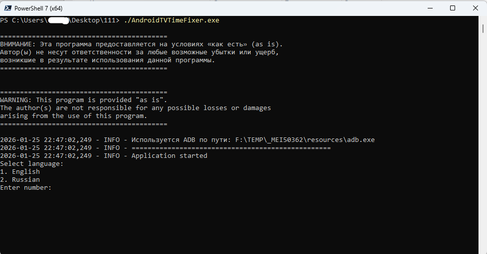
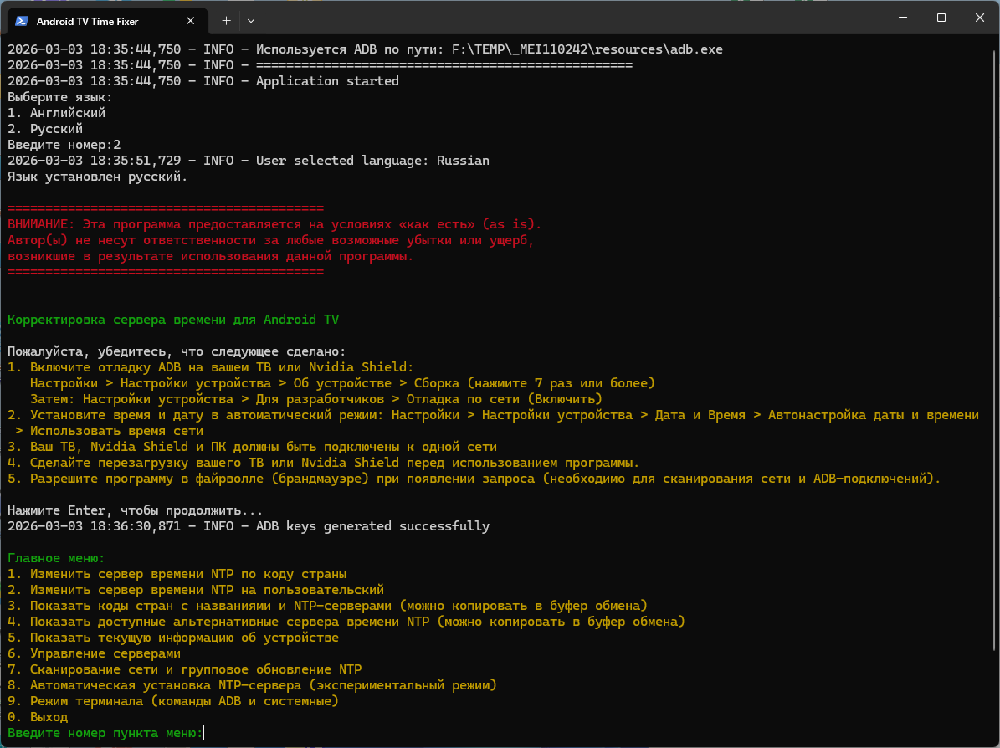

[English](https://github.com/civisrom/android-tv-date-time/blob/main/README_EN.md)

# Android TV Time Fixer

**Исправление проблем с синхронизацией времени на Android TV**

## Описание проблемы

Многие телевизоры и Android TV-приставки, особенно в регионах с сетевыми ограничениями (например, Крым, ДНР и ЛНР), сталкиваются с проблемой сброса системных часов после отключения от электросети. Несмотря на включенную функцию автоматической синхронизации времени, устройство не может подключиться к серверу времени, что приводит к следующим последствиям:

*   **Потеря доступа к интернет-приложениям:** Многие приложения требуют точного времени для корректной работы.
*   **Необходимость ручной установки времени:** Пользователю приходится вручную выставлять время каждый раз после отключения устройства от питания.
*   **Сообщение "Подключено, без доступа к интернету" в настройках Wi-Fi:** Это индикатор того, что устройство не может синхронизировать время с сервером.

**Причина:** Основной причиной является невозможность подключения устройства к стандартному NTP-серверу Google (`time.android.com`) из-за сетевых ограничений в указанных регионах.

**Решение:** Android TV Time Fixer позволяет решить эту проблему, заменяя стандартный NTP-сервер Google на альтернативный, доступный в вашем регионе.

## О программе

**Android TV Time Fixer** — это кроссплатформенная утилита для Windows, Linux и macOS, предназначенная для управления настройками NTP-сервера на устройствах Android TV через ADB (Android Debug Bridge).

## Скриншоты




## Основные возможности

*   **Многоязычный интерфейс:**
    *   Поддержка русского и английского языков
    *   Выбор языка при запуске программы
    *   Автоматическое сохранение и загрузка выбранного языка

*   **Изменение NTP-сервера:**
    *   Автоматическая установка по коду страны (65+ стран)
    *   Установка пользовательского NTP-сервера
    *   Валидация введённых данных (доменные имена и IP-адреса)
    *   Проверка доступности NTP-сервера перед применением
    *   Интерактивные подсказки и поиск по названию страны

*   **Просмотр информации:**
    *   Список доступных кодов стран с названиями и NTP-серверов
    *   Список альтернативных NTP-серверов (региональные пулы, Cloudflare, Google и др.)
    *   Интерактивный поиск по коду или названию страны

*   **Детальная информация об устройстве:**
    *   Модель и производитель
    *   Версия Android и API level
    *   Серийный номер
    *   Архитектура процессора и количество ядер
    *   Объём оперативной памяти
    *   Разрешение экрана и плотность
    *   Сетевые параметры (IP, MAC-адрес)
    *   Текущий NTP-сервер
    *   Статус батареи, часовой пояс, локаль
    *   Время работы устройства (uptime)
    *   Сравнение времени устройства и ПК

*   **Управление серверами:**
    *   Избранные серверы (добавление, удаление, просмотр)
    *   Копирование/вставка серверов из буфера обмена
    *   Пинг всех доступных NTP-серверов (110+)
    *   Отображение времени отклика (RTT)
    *   Процент успешных подключений
    *   Сортировка по доступности и скорости
    *   Экспорт/импорт настроек в JSON

*   **Сканирование сети и групповые операции:**
    *   Автоматическое сканирование локальной сети на устройства Android TV
    *   Обнаружение устройств с открытым ADB-портом 5555
    *   Подключение к найденным устройствам
    *   Групповое обновление NTP-сервера на нескольких устройствах
    *   Сравнение времени устройства с ПК (синхронизация)

*   **Автоматическая установка NTP (экспериментальный режим):**
    *   Полная автоматизация: сканирование сети → подключение → выбор лучшего NTP → установка
    *   Быстрая проверка всех NTP-серверов с выбором оптимального по RTT
    *   Топ-5 самых быстрых серверов с возможностью выбора

*   **Режим терминала:**
    *   Выполнение любых ADB-команд
    *   Выполнение системных команд
    *   Встроенная справка по командам ADB
    *   Управление приложениями, файлами, перезагрузка устройства

*   **Дополнительные функции:**
    *   Сохранение последнего использованного IP-адреса
    *   Копирование серверов в буфер обмена
    *   Автоматическая генерация ADB-ключей
    *   Переиспользование существующих подключений
    *   Подробное логирование в файл
    *   Предупреждение о необходимости разрешения в файрволле

## Установка и использование

### Windows

1.  Скачайте архив `AndroidTVTimeFixer-windows.zip` из раздела [Releases](https://github.com/civisrom/android-tv-date-time/releases).
2.  Распакуйте архив в удобное место на вашем компьютере, например, `D:\AndroidTVTimeFixer`.
3.  Запустите `AndroidTVTimeFixer.exe` или используйте `start.bat` / `start.ps1`.

Запуск через **PowerShell**

1.  Откройте **PowerShell** от имени администратора.
2.  Перейдите в папку с программой:
    ```powershell
    cd "D:\AndroidTVTimeFixer"
    ```
3.  Запустите программу:
    ```powershell
    .\AndroidTVTimeFixer.exe
    ```
### Linux

1.  Скачайте архив `AndroidTVTimeFixer-linux.zip` из раздела [Releases](https://github.com/civisrom/android-tv-date-time/releases).
2.  Распакуйте архив:
    ```bash
    unzip AndroidTVTimeFixer-linux.zip
    cd AndroidTVTimeFixer-linux
    ```
3.  Сделайте файл исполняемым и запустите:
    ```bash
    chmod +x AndroidTVTimeFixer
    ./AndroidTVTimeFixer
    ```

### macOS

1.  Скачайте архив `AndroidTVTimeFixer-macos.zip` из раздела [Releases](https://github.com/civisrom/android-tv-date-time/releases).
2.  Распакуйте архив и запустите приложение.

## Подготовка Android TV

### Включение отладки ADB (режим разработчика)

1.  Откройте на вашем Android TV: **Настройки** > **Настройки устройства** > **Об устройстве**.
2.  Нажмите 7 раз на пункт **"Сборка"**, чтобы разблокировать режим разработчика.
3.  Перейдите: **Настройки устройства** > **Для разработчиков**.
4.  Включите **"Отладка по сети"**.
5.  Откройте: **Настройки** > **Дата и время**.
6.  Включите: **Автонастройка даты и времени** > **Использовать время сети**.
7.  Для повышения безопасности рекомендуется отключить режим разработчика после завершения настройки NTP-сервера.

## Главное меню

```
1. Изменить сервер времени NTP по коду страны
2. Изменить сервер времени NTP на пользовательский
3. Показать коды стран с названиями и NTP-серверами
4. Показать доступные альтернативные серверы времени NTP
5. Показать текущую информацию об устройстве
6. Управление серверами
7. Сканирование сети и групповое обновление NTP
8. Автоматическая установка NTP-сервера (экспериментальный режим)
9. Режим терминала (команды ADB и системные)
0. Выход
```

### Подменю "Управление серверами"

```
1. Показать избранные серверы
2. Добавить текущий сервер в избранное
3. Копировать сервер в буфер обмена
4. Вставить сервер из буфера обмена
5. Удалить сервер из избранного
6. Пинговать NTP-серверы
7. Экспорт/импорт настроек
8. Вернуться в главное меню
```

### Подменю "Сканирование сети"

```
1. Сканировать локальную сеть на устройства Android TV
2. Подключиться к найденному устройству
3. Групповое обновление NTP (все найденные или введённые IP)
4. Статус синхронизации времени устройства
5. Назад в главное меню
```

## Совместимость

Программа протестирована и должна работать на устройствах Android TV (включая Nvidia Shield), которые соответствуют следующим требованиям:

*   Поддержка подключения через ADB по сети.
*   Поддержка управления NTP-сервером через команды `adb shell`.

**Поддерживаемые операционные системы:**
*   Windows 10/11
*   Linux (Ubuntu, Debian, Fedora и др.)
*   macOS

## Отказ от ответственности

**ВНИМАНИЕ: ВАЖНО ПРОЧИТАТЬ ПЕРЕД ИСПОЛЬЗОВАНИЕМ ПРОГРАММЫ**

Программа **Android TV Time Fixer** предоставляется на условиях **"как есть" (as is)**, без каких-либо гарантий, явных или подразумеваемых, включая, но не ограничиваясь, гарантии товарного качества, пригодности для конкретной цели и отсутствия нарушений прав.

**Отказ от ответственности за убытки:**

Автор(ы) и разработчики программы не несут ответственности за любые прямые, косвенные, случайные, специальные, штрафные или последующие убытки, включая, но не ограничиваясь, потерю данных, потерю прибыли, прерывание бизнеса, ущерб имуществу или любой другой ущерб, возникающий в результате использования или невозможности использования данной программы, даже если автор(ы) были предупреждены о возможности таких убытков.

**Отказ от гарантий:**

Мы не гарантируем, что:

*   Программа будет соответствовать вашим требованиям.
*   Работа программы будет бесперебойной и безошибочной.
*   Любые дефекты программы будут исправлены.
*   Использование программы не приведет к каким-либо негативным последствиям для вашего устройства или сети.
*   Программа будет совместима со всеми устройствами и версиями Android TV.
*   Программа будет работать корректно во всех регионах и сетях, включая регионы с сетевыми ограничениями.

**Согласие с условиями:**

Используя программу **Android TV Time Fixer**, вы:

*   **Соглашаетесь с условиями настоящего отказа от ответственности.**
*   **Принимаете на себя все риски**, связанные с использованием программы.
*   **Освобождаете автора(ов) и разработчиков от любой ответственности** за любые убытки или ущерб, которые могут возникнуть в результате использования программы.

**Изменения:**

Автор(ы) оставляют за собой право в любое время вносить изменения в данный отказ от ответственности без предварительного уведомления. Ваше дальнейшее использование программы после внесения изменений будет означать ваше согласие с измененными условиями.
