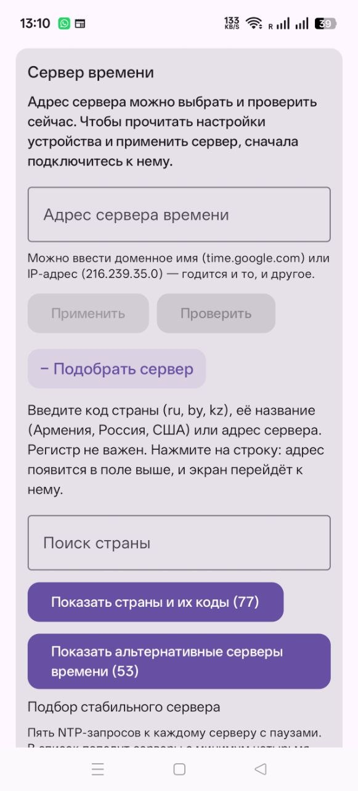
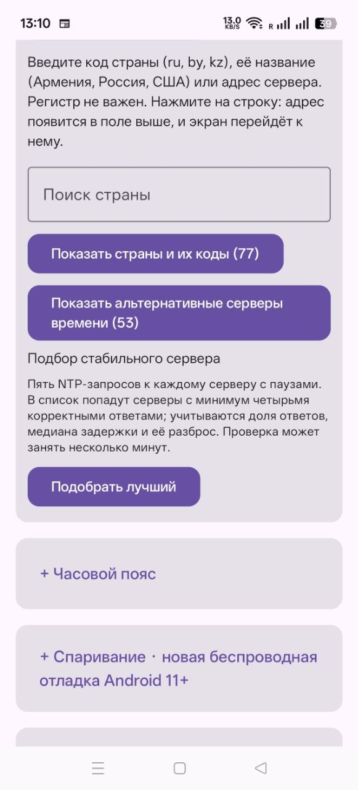
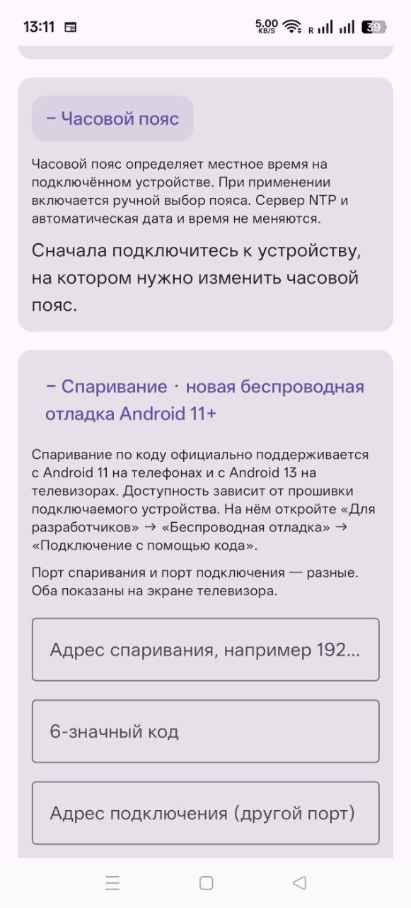
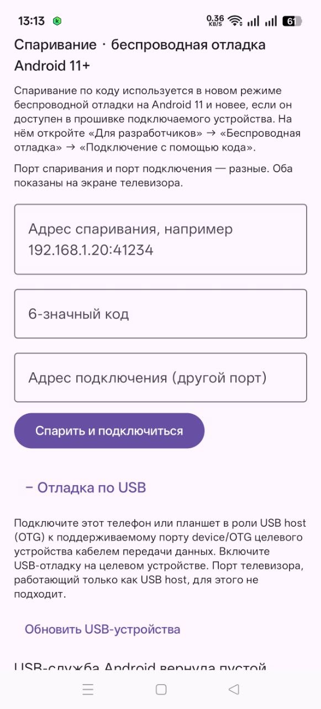
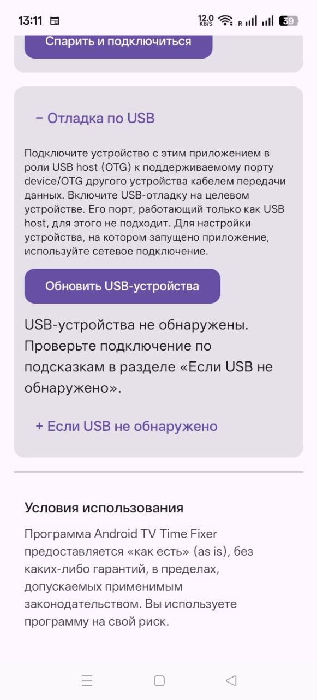

[English](https://github.com/civisrom/android-tv-date-time/blob/main/README_EN.md)

# Android TV Time Fixer

**Исправление проблем с синхронизацией времени на Android TV**

## Содержание

- [Основные возможности](#основные-возможности) и [с чего начать](#с-чего-начать)
- [Установка](#установка) и [подготовка Android TV](#подготовка-android-tv)
- [USB](#отладка-по-usb) и [беспроводная отладка Android 11+](#новая-беспроводная-отладка-на-современных-android-tv)
- [Главное меню](#главное-меню) и [работа на компьютере](#как-пользоваться-программой)
- [Скриншоты](#скриншоты)
- [Приложение для Android](#приложение-для-android)
- [Совместимость и проверенные сценарии](#совместимость)
- [Лицензия](#лицензия) и [отказ от ответственности](#отказ-от-ответственности)

## О программе

**Android TV Time Fixer** меняет адрес сервера точного времени (NTP) на
Android TV и других совместимых Android-устройствах через ADB — штатный
интерфейс отладки Android. Root для обычного сценария не требуется, но прошивка
должна разрешать изменение настройки через ADB.

Есть две версии:

*   **Программа для компьютера:** консольная утилита для Windows, Linux и macOS
    с групповыми операциями, избранным и терминалом.
*   **Приложение для Android:** APK для телефона, планшета или самого Android TV.
    Основные действия выполняются кнопками, без компьютера и ручных ADB-команд.
    **Android-приложение работает в тестовом режиме.**

## Описание проблемы

После отключения питания некоторые телевизоры и приставки теряют правильное
время. Если автоматическая синхронизация не может связаться с сервером NTP,
часы остаются неверными: нарушается проверка HTTPS-сертификатов, перестают
работать интернет-приложения, приходится выставлять дату вручную.

Одна из возможных причин — недоступность стандартного сервера
`time.android.com` из сети устройства. Программа позволяет указать альтернативный
сервер, доступный в вашем регионе. Она меняет настройку; синхронизацию затем
выполняет Android при включённой автоматической дате и времени.

Сообщение **«Подключено, без доступа к интернету»** само по себе не доказывает
проблему NTP: причиной также могут быть DNS, роутер или проверка доступности
интернета системой. Смена сервера помогает, когда причина связана именно
с получением времени, и не заменяет диагностику остальных сетевых неполадок.

## Основные возможности

*   **Подключение по USB:** Windows, Linux, macOS и Android с USB host/OTG.
    Выбор конкретного устройства, проверка ADB-соединения и доступ к настройке
    NTP без IP-адреса. См. [Отладка по USB](#отладка-по-usb).

*   **Отладка по сети через Wi-Fi или Ethernet:** подключение по IP-адресу
    и ADB-порту (обычно `5555`) к устройствам с включённой классической
    «Отладкой по сети». Доступна в десктопной программе и Android-приложении.

*   **Современная беспроводная отладка Android 11+:** поддержка нового режима
    «Беспроводная отладка» (Wireless debugging) на устройствах, где он доступен.
    Спаривание по шестизначному коду, обнаружение по mDNS и защищённое
    TLS-подключение без USB-кабеля — в Windows, Linux, macOS и Android-приложении.
    См. [Новая беспроводная отладка](#новая-беспроводная-отладка-на-современных-android-tv).

### Общие функции

*   **Настройка NTP:** выбор по стране, поиск по коду или названию, собственный
    адрес в виде доменного имени или IP. Общий справочник содержит **77 стран
    и 45 альтернативных серверов**: региональные пулы, Cloudflare, Google,
    ВНИИФТРИ и другие. Согласованность справочников проверяется при разработке.
*   **Проверка серверов времени:** настоящие NTP-запросы, время ответа (RTT),
    доля успешных ответов и расхождение с часами управляющего устройства.
    Проверка перед применением и подбор подходящего сервера из справочника.
*   **Подтверждение настройки:** после записи программа перечитывает значение
    NTP с устройства. Это подтверждает сохранение адреса; фактическая
    синхронизация часов выполняется самой системой Android.
*   **Сведения об устройстве:** модель, производитель, Android/API, процессор,
    память, экран, серийный номер, часовой пояс и время работы. Набор доступных
    полей зависит от прошивки; десктопная версия также показывает сетевые
    параметры и сравнивает время устройства с компьютером.
*   **Подключения с сохранённым доверием:** повторное использование ADB-ключей
    и проверка связи командой на устройстве. После отзыва разрешений может
    потребоваться новая авторизация или спаривание.
*   **Русский и английский интерфейс:** на компьютере язык выбирается при
    запуске и запоминается, в APK определяется языком системы.
*   **Версия на экране:** в главном меню десктопной программы и под названием
    Android-приложения; на компьютере также доступен параметр `--version`.

### Возможности программы для компьютера

*   Консольное меню для Windows, Linux и macOS; ADB включён в готовые сборки.
*   Сканирование локальной подсети с выбором ADB-порта и отдельный поиск по mDNS.
*   Групповая установка NTP на найденные или вручную указанные устройства.
*   Экспериментальная автоматическая настройка: выбор устройства, определение
    региона, проверка серверов, предложение пяти лучших и установка после
    подтверждения пользователя.
*   Избранные серверы, копирование и вставка, сохранение последнего адреса,
    экспорт и импорт настроек в JSON.
*   Терминал для ADB и системных команд: приложения, файлы, снимки экрана,
    диагностика и перезагрузка в пределах прав подключения.
*   Журнал в файле и собственный порт ADB-сервера. Расположение данных и
    особенности совместной работы с другим ADB описаны ниже.

### Возможности Android-приложения

*   Отдельный APK для телефона, планшета или Android TV: настройка без компьютера.
*   Постоянно раскрытые ввод IP, настройки NTP и спаривание Android 11+;
    дополнительные списки и справка сворачиваются.
*   Автоматический поиск по mDNS с раздельными адресами спаривания и подключения;
    найденное устройство отмечается зелёным, рядом показаны имя и адрес.
*   Проверка NTP до подключения, подбор пяти лучших серверов с ходом поиска
    и кнопкой остановки; выбор доменного имени или полученного IP-адреса.
*   USB host/OTG с выбором устройства и диагностикой обнаружения.
*   Локальная история операций по кнопке «Диагностика», копирование отчёта
    и очистка. Автоматической отправки журнала нет.
*   Поддержка пульта Android TV, крупного шрифта и горизонтального экрана.

## С чего начать

1. Установите программу на компьютер либо APK на телефон/планшет.
2. Включите отладку на **управляемом устройстве**, где требуется исправить время.
3. Выберите способ связи: **USB** — кабель и разрешение RSA;
   **классический ADB по сети** — IP и порт; **беспроводная отладка Android 11+** —
   спаривание по коду, затем подключение к отдельному порту.
4. Подключитесь и прочитайте текущие сведения. На компьютере это **пункт 5**;
   в APK состояние подключения и параметры устройства показаны на главном экране.
5. Выберите и проверьте сервер времени, примените его и проверьте прочитанное
   значение. На компьютере используйте **пункт 1 или 2**, в APK — «Сервер времени».

Для сетевого ADB устройства должны быть доступны друг другу в локальной сети.
Телефон может работать по Wi-Fi, а телевизор — по Ethernet того же роутера,
если прошивка разрешает выбранный режим отладки. Гостевая сеть, изоляция клиентов,
VPN или фильтрация multicast могут мешать связи и обнаружению. USB не требует
общей сети, но проверка NTP и дальнейшая синхронизация требуют сетевого доступа.

## Установка

### Windows

1.  Скачайте архив `AndroidTVTimeFixer-windows.zip` из раздела [Releases](https://github.com/civisrom/android-tv-date-time/releases).
2.  Распакуйте архив в удобное место на вашем компьютере, например, `D:\AndroidTVTimeFixer`.
3.  Запустите `AndroidTVTimeFixer.exe` или используйте `start.bat` / `start.ps1`.

Запуск через **PowerShell**

1.  Откройте **PowerShell** в обычном режиме. Для повседневного запуска права администратора не требуются.
2.  Перейдите в папку с программой:
    ```powershell
    cd "D:\AndroidTVTimeFixer"
    ```
3.  Запустите программу:
    ```powershell
    .\AndroidTVTimeFixer.exe
    ```

### Linux

1.  Скачайте архив `AndroidTVTimeFixer-linux.zip` из раздела [Releases](https://github.com/civisrom/android-tv-date-time/releases).
2.  Распакуйте архив:
    ```bash
    unzip AndroidTVTimeFixer-linux.zip
    ```
3.  Сделайте файл исполняемым и запустите:
    ```bash
    chmod +x AndroidTVTimeFixer
    ./AndroidTVTimeFixer
    ```

### macOS

1. Скачайте `AndroidTVTimeFixer-macos.zip` из [Releases](https://github.com/civisrom/android-tv-date-time/releases).
   Текущая готовая сборка предназначена для **Apple Silicon (arm64)**.
2. Распакуйте архив и откройте Терминал в его папке. Это консольная программа:
   ```bash
   chmod +x AndroidTVTimeFixer
   ./AndroidTVTimeFixer
   ```
3. Если macOS блокирует запуск скачанного файла, проверьте источник и причину
   в **Системные настройки → Конфиденциальность и безопасность**.
   Для Intel Mac нужна отдельная сборка под x86-64.

### Android (APK)

1.  Скачайте `AndroidTVTimeFixer-2.6.2.apk` из [предварительного выпуска 2.6.2](https://github.com/civisrom/android-tv-date-time/releases/tag/v2.6.2). [Что изменилось](release-notes/v2.6.2-ru.md).
2.  Сверьте контрольную сумму с файлом `.apk.sha256` рядом:
    ```bash
    sha256sum -c AndroidTVTimeFixer-2.6.2.apk.sha256
    ```
3.  Установите:
    *   **На телефон** — откройте файл и разрешите установку из неизвестных
        источников для файлового менеджера или браузера.
    *   **На сам Android TV** — либо через `adb install AndroidTVTimeFixer-2.6.2.apk`
        с компьютера, либо любым файловым менеджером на телевизоре. Иконка
        появится и в обычном лаунчере, и в лаунчере Android TV.

Требуется **Android 6.0** или новее. Подробности — в разделе
[Приложение для Android](#приложение-для-android).

**Google Play Защита.** APK распространяется через GitHub Releases.
При установке не из Google Play система может предложить проверку или показать
предупреждение; такое сообщение не обязательно появляется у каждого пользователя.
Читайте его конкретную причину: неизвестный разработчик и обнаруженная угроза
не означают одно и то же. Контрольная сумма помогает проверить целостность
скачанного файла, а совместимая подпись нужна для обновления уже установленного
приложения. Подробнее — [справка Google Play Защиты](https://support.google.com/googleplay/answer/2812853).

### Данные приложения

**Десктопная программа** переносимая: по умолчанию её настройки и журнал хранятся **рядом с исполняемым файлом**
(`keys/`, `adb/`, `settings.json`, `saved_servers.json`, `android_tv_fixer.log`).

- `keys/` — ключ для прямого подключения по «отладке по сети» (старый протокол ADB).
- `adb/` — собственный каталог `adb` для беспроводной отладки Android 11+: там
  лежат ключ и список спаренных устройств. При первом запуске существующие ключи
  из `~/.android` копируются сюда, чтобы уже спаренные устройства продолжили
  работать. **Только Linux и macOS:** на Windows `adb` определяет профиль
  пользователя через системный API и игнорирует переменные окружения, поэтому
  его ключи там остаются в `%USERPROFILE%\.android` (проверено на
  platform-tools 37.0.1).

Собственный порт ADB-сервера программа использует на **всех** платформах
и не завершает чужие сессии автоматически. Однако разные ADB-серверы могут
конкурировать за одно USB-устройство; отдельный порт не устраняет такой конфликт.

Если в папку программы писать нельзя (например, после установки в `Program Files`), данные автоматически уходят в каталог пользователя:

- Windows: `%LOCALAPPDATA%\AndroidTVTimeFixer`
- Linux: `$XDG_DATA_HOME/AndroidTVTimeFixer` или `~/.local/share/AndroidTVTimeFixer`
- macOS: `~/Library/Application Support/AndroidTVTimeFixer`

В этом случае при первом запуске существующие настройки и ADB-ключи из папки программы
копируются автоматически.

Данные APK хранятся отдельно, в закрытой папке Android-приложения. Правила
хранения его журнала описаны в разделе [Диагностика](#если-приложение-ведёт-себя-странно).

## Подготовка Android TV

### Шаг 1. Включите режим разработчика

1.  Откройте на вашем Android TV: **Настройки** > **Настройки устройства** > **Об устройстве**.
2.  Нажмите 7 раз на пункт **"Сборка"**, чтобы разблокировать режим разработчика.
3.  Перейдите: **Настройки устройства** > **Для разработчиков**.

### Шаг 2. Включите отладку — USB или один из сетевых вариантов

Для кабельного подключения включите **«Отладка по USB»** и следуйте разделу
[Отладка по USB](#отладка-по-usb). Ниже описаны варианты подключения по сети.

В разделе «Для разработчиков» найдите **один** из этих пунктов. Какой именно
доступен — зависит от версии Android и возможностей прошивки.

**Вариант А — классическая сетевая отладка.** На разных прошивках переключатель
может называться **«Отладка по сети»**, **«ADB debugging»** или даже
**«Отладка по USB»**. Если устройство открыло legacy ADB на порту **5555**,
программе достаточно его IP-адреса независимо от названия пункта в меню.

> **Xiaomi Mi TV и Mi Box.** На части моделей и прошивок Xiaomi отдельного
> пункта «Отладка по сети» действительно нет. Сама Xiaomi документирует для
> этих устройств один переключатель **ADB debugging** в разделе
> «Учётная запись и безопасность». На некоторых моделях включение этого пункта
> (в отдельных переводах он называется «Отладка по USB») одновременно делает
> ADB доступным по локальной сети на порту **5555**. Поэтому попробуйте ввести
> IP-адрес телевизора вручную: программа подставит порт 5555. Это поведение не
> гарантировано для всех телевизоров Xiaomi и может изменяться с прошивкой; если
> порт закрыт, нужен отдельный пункт сетевой/беспроводной отладки либо штатная
> настройка ADB через USB. См. [официальную инструкцию Xiaomi](https://www.mi.com/ru/support/article/KA-15083/)
> и [подтверждённый владельцами пример для Mi TV 4A/4S](https://4pda.to/forum/index.php?showtopic=957045&st=6200).

**Вариант Б — «Беспроводная отладка» со спариванием (Android 11+).**
Если прошивка предлагает этот режим, включите его и разрешите работу в вашей
сети. В программе для компьютера откройте **пункт 11**, в APK — **«Спаривание
устройства»**. Окно с кодом на целевом устройстве держите открытым до завершения
спаривания. Для последующего соединения нужен отдельный адрес подключения
с основного экрана отладки или из mDNS.

Программа определяет протокол при соединении, но введённый адрес должен
содержать правильный порт: одного IP с автоматически подставленным `5555`
для современного режима обычно недостаточно.

### Шаг 3. Разрешите автосинхронизацию времени

1.  Откройте: **Настройки** > **Дата и время**.
2.  Включите: **Автонастройка даты и времени** > **Использовать время сети**.

Без этого устройство не станет обращаться к NTP-серверу, который вы зададите.

### Шаг 4. После настройки

После настройки отключите использованный режим отладки, если он больше не нужен.
Адрес записывается в системные настройки и обычно сохраняется после перезагрузки;
сброс настроек или особенности прошивки могут изменить его. Отключение отладки
не отключает автоматическую синхронизацию времени.

## Отладка по USB

Для USB-подключения нужны кабель **передачи данных**, включённая **USB-отладка**
на целевом Android-устройстве и подтверждение запроса RSA на его экране.
Телевизор/приставка должны предоставлять интерфейс ADB через поддерживаемый
порт device/OTG: обычный USB host для флешек не становится таким портом от
включения переключателя. Проверьте назначение порта в инструкции производителя.
На телефоне, управляющем телевизором, требуется USB host/OTG.
[Модель USB host в Android](https://developer.android.com/develop/connectivity/usb/host).

**Windows, Linux, macOS:**

1. Подключите целевое устройство к компьютеру и включите на нём USB-отладку.
2. В программе выберите **12. Подключиться по USB**, введите номер нужного
   устройства и нажмите Enter.
   Можно также ввести `u` при запросе адреса в пунктах 1, 2 и 5.
3. Если требуется подтверждение, разрешите USB-отладку на целевом устройстве,
   нажмите `r` для обновления списка и повторите выбор.
4. После проверки связи используйте обычные пункты изменения NTP и информации
   об устройстве. При следующем запросе адреса Enter использует выбранное USB.

После выбора USB-устройства пункт **9. Автонастройка NTP** также работает с
ним, без поиска другого устройства по сети.

На Windows может понадобиться [ADB-драйвер производителя](https://developer.android.com/studio/run/oem-usb).
В Ubuntu/Debian при ошибке доступа установите правила udev из пакета
`android-sdk-platform-tools-common` и проверьте членство пользователя в
`plugdev`; после изменения групп войдите в систему заново. В macOS отдельный
ADB-драйвер обычно не требуется.
[Официальная подготовка компьютера](https://developer.android.com/studio/run/device).

В поставку включён ADB 37.0.1. При запуске из исходников установите Platform
Tools и добавьте `adb` в `PATH` либо поместите бинарник в `resources/` в корне
проекта (Windows: также `AdbWinApi.dll` и `AdbWinUsbApi.dll`). Для USB используется
собственный ADB-сервер приложения. Если другой сервер уже занял USB-интерфейс,
закройте его сессию и переподключите кабель: приложение не завершает чужие
процессы автоматически. Терминальный режим принимает обычные команды
`adb devices -l`, `adb -d shell ...` или `adb -s SERIAL shell ...`.

**Приложение для Android:**

1. Подключите телефон/планшет к целевому устройству через OTG и кабель данных.
2. В разделе **«Отладка по USB»** обновите список и нажмите **«Подключиться по USB»**.
3. Разрешите системный запрос доступа к USB на телефоне, затем подтвердите
   отдельный запрос RSA на телевизоре. Это два разных разрешения.
4. После проверки связи доступны те же настройки NTP и сведения об устройстве.
   При отключении кабеля соединение закрывается; для продолжения выберите
   устройство снова. USB не требует root или шестизначного кода pairing.

Если список пуст, приложение различает отсутствие USB-устройств на уровне
Android и наличие USB без интерфейса ADB. Нажмите **«Обновить USB-устройства»**:
результат доступен также в диагностике. При подключении ADB-устройства Android
может предложить открыть приложение; само соединение выполняется кнопкой.
Пустой список сам по себе не устанавливает причину. В **«Диагностика → Подробнее»**
для поиска USB сохраняются исходные счётчики устройств и системные флаги роли USB.
Сведения о роли необязательны: прошивка может не предоставлять их или обновлять
с задержкой; отсутствие флага показывается как `unknown`, а не как выключенный OTG.

Для **SHIELD без micro-USB** используется порт 1, дальний от HDMI, переведённый
в режим подключения к ПК. Телефон должен быть USB-хостом. Обычный кабель
USB-A → USB-C может задавать телефону обратную роль; необходима подходящая
схема OTG с передачей данных. См. [инструкцию NVIDIA](https://nvidia.custhelp.com/app/answers/detail/a_id/4344/kw/10)
и [описание USB-C кабелей Chromium](https://www.chromium.org/chromium-os/developer-library/reference/hardware/cable-and-adapter-tips-and-tricks/).

Общая Wi-Fi-сеть для USB ADB не нужна. Проверка NTP-серверов выполняется через
интернет управляющего устройства, а последующая синхронизация времени требует
доступа самого телевизора к выбранному NTP-серверу. Приложение не переключает
устройство в `adb tcpip` и не включает отладку автоматически. Сетевое
сканирование и групповые сетевые операции по-прежнему работают с IP-адресами.

## Новая беспроводная отладка на современных Android TV

Современная Wireless debugging появилась в Android 11 для телефонов; официальная поддержка
TV начинается с Android 13. Название «Android 11+» относится к этому режиму
спаривания; оно не означает, что любой телевизор с Android 11 обязательно
предлагает такую функцию.

### Когда нужен этот режим

На некоторых прошивках Google TV Streamer и Chromecast with Google TV после
обновления до Android 14 основной сетевой способ подключения — «Беспроводная
отладка» по коду. Ориентируйтесь на пункты, доступные на вашем устройстве:
номер версии Android не гарантирует одинаковое меню у всех производителей.
Инструкции для классического порта `5555` не заменяют спаривание с таким сервисом.

### Чем новая схема отличается от старой

| | Старая «Отладка по сети» | Современная Wireless debugging |
|---|---|---|
| Первый доступ | подтверждение RSA-ключа или уже разрешённый клиент | обязательное спаривание по 6-значному коду |
| Порт | обычно постоянный `5555` | динамические и разные pairing/connect-порты |
| Обнаружение | IP и порт часто вводятся вручную | сервисы объявляются в локальной сети через mDNS |
| Транспорт | обычный ADB TCP | аутентифицированное TLS-подключение после pairing |
| Повторное использование | сохранённый адрес часто работает снова | доверенный ключ сохраняется, но актуальный порт может измениться |

Из этого следуют три важных правила:

*   **Нужно спаривание.** Устройство не примет новый клиент, пока вы не введёте
    6-значный код из текущего открытого окна. После успешного pairing ключ
    остаётся доверенным до отзыва авторизации, очистки данных или переустановки.
*   **Порты случайные.** Для спаривания и для подключения они **разные**, и они
    могут изменяться при перезапуске отладки или окна с кодом. Используйте
    актуальные значения с экрана или из mDNS.
*   **Соединение шифрованное.** Старые клиенты ADB его просто не понимают.

Поэтому mDNS здесь решает реальную проблему: программа получает актуальные
адреса pairing и connect из объявлений самого устройства и не заставляет
пользователя переписывать меняющиеся порты. Если роутер блокирует multicast,
оба адреса по-прежнему можно ввести вручную.

Официальное описание требований и процедуры pairing находится в
[документации Android Debug Bridge](https://developer.android.com/tools/adb#connect-to-a-device-over-wi-fi).

### Как пользоваться этим режимом

В готовых сборках для Windows, Linux и macOS уже есть необходимый ADB;
Android Studio и отдельная установка SDK не нужны. Откройте
[пункт 11 — Беспроводная отладка Android 11+](#пункт-11--беспроводная-отладка-android-11).
После спаривания обычные пункты меню работают через защищённое соединение.
В APK используйте постоянно раскрытую форму
[«Спаривание устройства»](#5-спаривание-устройства--код-для-android-11-и-новее).

Обе программы различают mDNS-сервисы спаривания и подключения и проверяют
установленную связь командой на устройстве. Наличие сервиса в списке ещё не
означает, что устройство разрешило доступ этому клиенту. При недоступном mDNS
вводите адреса с текущих экранов отладки вручную.

## Главное меню

```
 1. Изменить сервер времени NTP по коду страны
 2. Изменить сервер времени NTP на пользовательский
 3. Показать коды стран с названиями и NTP-серверами (можно копировать в буфер обмена)
 4. Показать доступные альтернативные сервера времени NTP (можно копировать в буфер обмена)
 5. Показать текущую информацию об устройстве
 6. Пинговать NTP-серверы
 7. Управление серверами
 8. Сканирование сети и групповое обновление NTP
 9. Автоматическая установка NTP-сервера (экспериментальный режим)
10. Режим терминала (команды ADB и системные)
11. Беспроводная отладка Android 11+ (спаривание и поиск по mDNS)
12. Подключиться по USB
 0. Выход
```

## Скриншоты

### Программа для компьютера


### Приложение на смартфоне

Скриншоты русской версии APK 2.6.2, установленной на смартфоне.
Нажмите на изображение, чтобы открыть его в полном размере.

| Подключение к устройству | Настройка и проверка NTP | Подбор сервера времени |
|:---:|:---:|:---:|
| [](screenshots/photo_apk_ru1.jpg) | [](screenshots/photo_apk_ru2.jpg) | [](screenshots/photo_apk_ru3.jpg) |

| Спаривание Android 11+ | USB и сведения об устройстве |
|:---:|:---:|
| [](screenshots/photo_apk_ru4.jpg) | [](screenshots/photo_apk_ru5.jpg) |

## Как пользоваться программой

### Выбор устройства и проверка NTP

В пунктах, использующих общий запрос адреса (например, 1, 2 и 5), доступны
следующие способы ввода. При уже выбранном USB программа сначала предлагает
использовать это устройство; `n` позволяет выбрать другое.

| Ввод | Что произойдёт |
|---|---|
| номер из списка | подключиться к найденному устройству |
| Enter | использовать выбранное USB-подключение или сохранённый адрес, как указано в подсказке |
| `192.168.1.20` или `192.168.1.20:37105` | ввести адрес вручную |
| `m` | искать по сети заново (порт мог смениться) |
| `s` | просканировать всю подсеть перебором |
| `192.168.1.0/24` | просканировать указанную подсеть |
| `u` | выбрать USB-устройство |
| `q` | вернуться в меню |

Для mDNS программа использует встроенный `adb` и запасной путь через
`zeroconf`. Этот поиск отличается от перебора подсети: он получает объявления
с актуальными портами, а сканирование проверяет один выбранный порт.

Перед записью NTP проверяется ответ сервера и расхождение с часами компьютера
(не более 60 секунд). Поэтому сначала убедитесь, что время на компьютере
верное. Успешная запись подтверждается чтением настройки обратно; это ещё
не подтверждение, что телевизор уже синхронизировал часы.

### Пункт 1 — Изменить сервер времени NTP по коду страны

Выберите устройство через общий запрос адреса или используйте выбранное USB.
После подключения программа показывает текущие настройки и предлагает ввести
двухбуквенный код страны (например, `ru`, `by`, `de`). Ввод `?название` ищет
страну по названию. Сервер выбранного региона проверяется, записывается на
устройство, затем значение перечитывается для подтверждения.

> **Подсказка:** Если вы не знаете код своей страны, сначала откройте **пункт 3** — там отображается полный список кодов стран с названиями и NTP-серверами. Скопируйте нужный код в буфер обмена и вставьте его при запросе в пункте 1.

### Пункт 2 — Изменить сервер времени NTP на пользовательский

Аналогично пункту 1, но вместо кода страны вы вводите доменное имя или IP-адрес
NTP-сервера. Программа проверяет формат и ответ по NTP, затем устанавливает
сервер и перечитывает результат.

> **Подсказка:** Адрес NTP-сервера можно взять из **пункта 3** (серверы по странам) или **пункта 4** (альтернативные серверы — Cloudflare, Google и др.). Откройте нужный пункт, скопируйте адрес сервера в буфер обмена и вставьте его при запросе в пункте 2.

### Пункт 3 — Показать коды стран с названиями и NTP-серверами

Выводит полный список поддерживаемых кодов стран (77), их названия и соответствующие NTP-серверы. Можно использовать интерактивный поиск. Результаты можно скопировать в буфер обмена.

> **Использование результатов:** Скопированный код страны можно вставить в **пункте 1**, а скопированный адрес NTP-сервера — в **пункте 2** при ручной настройке.

### Пункт 4 — Показать доступные альтернативные NTP-серверы

Показывает список альтернативных NTP-серверов: региональные пулы, Cloudflare, Google и другие. Результаты можно скопировать в буфер обмена.

> **Использование результатов:** Скопированный адрес сервера можно вставить в **пункте 2** для ручной установки на устройство.

### Пункт 5 — Показать текущую информацию об устройстве

Подключается к устройству и выводит подробную информацию: модель, производитель, версия Android, серийный номер, CPU, RAM, разрешение экрана, сетевые параметры (IP, MAC), текущий NTP-сервер, часовой пояс, аптайм, а также сравнение времени устройства и ПК.

### Пункт 6 — Пинговать NTP-серверы

Проверяет 122 адреса из справочника настоящими запросами NTP, а не ICMP ping.
Показывает время отклика (RTT) и долю успешных ответов, сортирует результаты
по доступности, доле ответов и скорости. Большое число недоступных адресов
увеличивает длительность проверки из-за ожидания тайм-аутов.

### Пункт 7 — Управление серверами

```
1. Показать избранные серверы
2. Добавить текущий сервер в избранное
3. Копировать сервер в буфер обмена
4. Вставить сервер из буфера обмена
5. Удалить сервер из избранного
6. Пинговать NTP-серверы
7. Экспорт / Импорт настроек
8. Вернуться в главное меню
```

Открывает подменю для работы с избранными серверами:

- **Показать избранные** — список сохранённых серверов

- **Добавить текущий сервер** — сохраняет текущий NTP-сервер устройства в избранное

- **Копировать сервер** — копирует текущий сервер устройства в буфер обмена

- **Вставить сервер** — устанавливает на устройство сервер из буфера обмена

- **Удалить сервер** — удаляет выбранный сервер из списка избранного

- **Экспорт / Импорт настроек** — сохранение и восстановление всех настроек (язык, IP, избранные серверы) в JSON-файл

#### Подменю «Экспорт / Импорт настроек»

```
1. Экспортировать настройки в файл
2. Импортировать настройки из файла
3. Назад
```

### Пункт 8 — Сканирование сети и групповое обновление NTP

```
1. Сканировать локальную сеть на устройства Android TV
2. Подключиться к найденному устройству
3. Групповое обновление NTP (все найденные или введённые IP)
4. Статус синхронизации времени устройства
5. Назад в главное меню
```

Открывает подменю для работы с несколькими устройствами:

- **Сканировать сеть** — сначала спрашивает ADB-порт (Enter — 5555, значение запоминается), затем находит устройства Android TV в локальной сети. Найденные адреса показываются в виде `IP:порт`, так что нестандартный порт дальше подставляется сам

- **Подключиться к найденному устройству** — выбрать и подключиться к одному из обнаруженных устройств

- **Групповое обновление NTP** — установить NTP-сервер сразу на все найденные или вручную введённые устройства

- **Статус синхронизации времени** — сравнить время устройства с временем ПК

### Пункт 9 — Автоматическая установка NTP-сервера (экспериментальный режим)

Помогает выбрать устройство и подходящий сервер:

1. Использует уже выбранное USB-устройство. Если USB не выбран, спрашивает
   ADB-порт и сканирует локальную сеть.
2. Подключается к единственному найденному устройству либо предлагает выбрать.
3. Определяет регион по часовому поясу компьютера и проверяет справочник NTP.
4. Отбирает серверы с ответом и расхождением часов не более 60 секунд.
   Сначала учитывает долю успешных ответов, затем RTT; региональные серверы
   получают небольшой приоритет при одинаковой доле ответов.
5. Показывает до пяти лучших вариантов. Можно выбрать другой номер из списка.
6. Спрашивает подтверждение установки, записывает адрес и проверяет результат.

При разных динамических портах беспроводной отладки удобнее сначала найти
устройство через mDNS в пункте 11 и настроить NTP в пункте 1 или 2:
перебор подсети проверяет один заданный порт.

### Пункт 10 — Режим терминала

Интерактивный режим для выполнения любых ADB и системных команд. Полезен для продвинутых пользователей:
- Управление приложениями (установка, удаление)
- Передача файлов (push/pull)
- Снимки экрана и запись видео
- Диагностика системы
- Перезагрузка устройства

Команды: `help` — справка, `clear` — очистка экрана, `exit` — выход из терминала.

### Пункт 11 — Беспроводная отладка Android 11+

```
1. Спарить устройство по коду
2. Найти устройства по mDNS
3. Вернуться в главное меню
```

Используйте этот пункт для режима **«Беспроводная отладка»** со спариванием
по коду. Для классического ADB на порту 5555 эта процедура не нужна.

Открывает подменю из двух действий.

**1. Спарить устройство по коду.** Обычно достаточно одного спаривания для
сохранённого ADB-ключа. После удаления ключа, отзыва доступа или истечения
авторизации процедуру может потребоваться повторить.

1.  На телевизоре: **Для разработчиков** > **Беспроводная отладка** >
    **Подключение с помощью кода**. На экране появятся адрес, порт и
    6-значный код.
2.  В программе выберите пункт 1. Она сама поищет устройства по mDNS и покажет
    список — выберите номером. Если mDNS недоступен, введите адрес вручную в
    виде `192.168.1.20:41234` (порт **спаривания** с экрана телевизора).
3.  Введите 6-значный код.
4.  После успешного спаривания программа спросит адрес для подключения.
    **Внимание: это другой порт.** Он показан на основном экране «Беспроводная
    отладка», а не в окне спаривания. Через mDNS программа подставит его сама.

**2. Найти устройства по mDNS.** Показывает две группы: устройства, ожидающие
спаривания (у них на экране открыт диалог с кодом), и готовые к подключению.
Из второй группы можно начать подключение, выбрав номер; новому клиенту TLS
может потребоваться спаривание. Во вторую группу
попадают и устройства с классической «Отладкой по сети» — на части прошивок
(например, Nvidia Shield) экрана «Беспроводная отладка» нет вовсе, и устройство
объявляет себя только старым способом.

После спаривания и подключения все остальные пункты меню работают как обычно:
смена NTP, информация об устройстве, терминал.

### Пункт 12 — Подключиться по USB

Открывает список USB ADB-устройств. **Введите номер нужного устройства и
нажмите Enter**; `r` обновляет список, `q` возвращает в меню. При статусе
`UNAUTHORIZED` разрешите запрос RSA на целевом устройстве и обновите список.
После проверочной команды программа выводит имя успешно подключённого
устройства и предлагает пункт 5 для сведений либо пункты 1 и 2 для NTP.
Подробности кабелей, драйверов и разрешений — в разделе
[Отладка по USB](#отладка-по-usb).

### Пункт 0 — Выход

Завершение работы программы.

## Приложение для Android

APK настраивает одно подключённое устройство через USB, классический ADB
по сети или беспроводную отладку со спариванием. Основной путь: подключиться,
выбрать и проверить NTP, применить настройку и прочитать результат. Спаривание
нужно только для современного беспроводного режима, а не для каждого способа связи.

### Что нужно приготовить до начала

1. Для сетевого ADB обеспечьте доступ между устройствами в локальной сети.
   Не используйте изолированную гостевую сеть. Для USB подготовьте телефон/планшет
   с host/OTG, кабель данных и подходящий порт целевого устройства.
2. Включите отладку **на целевом устройстве** по разделу
   [Подготовка Android TV](#подготовка-android-tv). На управляющем телефоне
   USB-отладку включать не требуется: при кабельном подключении ему нужен host/OTG.
3. Проверьте дату и время на устройстве с APK: с ними сравниваются ответы NTP.
   Если APK установлен на самом телевизоре со сбитыми часами, предварительно
   задайте на нём примерно правильные дату и время.
4. При проблемах сетевой связи проверьте VPN, изоляцию клиентов роутера и
   автоматическое переключение телефона на мобильный интернет. Выключать
   сотовую связь для каждого подключения не требуется.

### Разделы экрана приложения

Приложение — один экран, который листается. Ввод IP-адреса подключения,
основные настройки сервера времени и спаривание всегда раскрыты, в том числе
после подключения. Дополнительные списки и справку можно сворачивать.

#### 1. Заголовок и режим работы

Под названием одна строка: «Запущено на телефоне: подключение к телевизору по
сети или USB» либо «Запущено на телевизоре». Приложение определяет это само, менять
ничего не нужно.

#### 2. «Подключение к устройству»

Здесь показано текущее состояние, и **оно выделено цветом**, чтобы было видно
сразу, не вчитываясь:

*   **зелёным** — «Подключено к 192.168.0.112:5555», связь есть;
*   **красным** — «Не подключено» либо причина отказа;
*   обычным цветом — «Подключение к…», пока идёт попытка.

**Поле ввода** принимает две записи:

| Что вводить | Когда |
|---|---|
| `192.168.0.112` | обычно; порт `5555` подставится сам |
| `192.168.0.112:37105` | если у отладки нестандартный порт |

Адрес телевизора смотрят в его настройках: **Настройки → Сеть и Интернет →**
ваша сеть, либо **Настройки → Об устройстве → Состояние**.

Кнопка **«Подключиться»** проверяет связь по-настоящему: она выполняет на
телевизоре пробную команду и смотрит на ответ. Поэтому «Подключено» здесь
означает, что связь действительно есть, а не что адрес похож на правильный.

**Что может ответить кнопка:**

*   *«Подтвердите запрос на экране устройства»* — на телевизоре появилось окно
    «Разрешить отладку с этого компьютера?». Нажмите там **«Разрешить»** (и
    лучше отметьте «Всегда разрешать»), затем повторите подключение.
*   *«Устройству нужно спаривание по коду»* — это Android 11+ с беспроводной
    отладкой, см. раздел «Спаривание» ниже.
*   *«Не удаётся достучаться до устройства»* — телевизор не отвечает по этому
    адресу: другая сеть, опечатка в адресе, либо отладка выключена.
*   *«Неверный адрес»* — в поле не IP-адрес.

После подключения появляется кнопка **«Отключиться»**. Поле IP и форма
спаривания остаются видимыми; редактирование адреса само по себе не меняет
текущее соединение.

#### 3. «Автоматически обнаруженные устройства в сети»

Приложение само ищет телевизоры по mDNS — это протокол, которым устройства
объявляют о себе в локальной сети. **Ни адрес, ни порт знать не нужно**: если
телевизор найден, он появится здесь сам.

Раздел можно сворачивать; при появлении новых результатов он раскрывается
автоматически. Зелёная надпись **«Найдено устройство»** означает обнаружение,
а не установленное соединение. Рядом показаны имя, адрес и тип сервиса:

*   **«Отладка по сети»** — классическая отладка на порту 5555. Кнопка
    **«Подключиться»** начинает соединение; может потребоваться разрешение RSA.
*   **«Готово к подключению»** — беспроводная отладка Android 11+, устройство
    объявляет TLS-порт. Это не подтверждение спаривания с вашим приложением:
    при первом подключении может потребоваться код.
*   **«Ожидает спаривания»** — на экране телевизора открыт диалог спаривания.
    Подключиться нельзя, пока не введён код, поэтому кнопка здесь —
    **«Спарить»**: она подставит адрес в форму спаривания ниже.

Если список пуст, ничего страшного: вводите адрес руками в разделе выше.

**Авторизация.** При классическом ADB подтвердите на целевом устройстве
запрос RSA с отпечатком ключа; «Всегда разрешать» сохраняет доверие к клиенту.
При современной беспроводной отладке доверие устанавливается спариванием
по коду. Это разные процедуры; наличие устройства в mDNS не заменяет их.

**Про разрешения.** Используемый системный mDNS на Android 13-16 не требует
`NEARBY_WIFI_DEVICES`. В текущей сборке (`targetSdk = 36`) дополнительный
запрос не нужен и на Android 17. При переходе на target SDK 37 потребуется
`ACCESS_LOCAL_NETWORK`; отказ ограничит не только поиск, но и прямое
подключение по адресу. Основание: [правила доступа к локальной сети Android](https://developer.android.com/privacy-and-security/local-network-permission).

#### 4. «Сервер времени»

Раздел постоянно виден под меню автопоиска. Выбрать адрес сервера и
проверить его доступность можно до подключения к устройству. Кнопка
**«Применить»** доступна после установления связи; до этого показано пояснение.
Поиск, списки и сканирование находятся в сворачиваемом блоке **«Подобрать сервер»**. Ход уже запущенного
сканирования и его остановка видны даже при свёрнутом блоке.

После подключения строка **«Текущий:»** показывает значение, прочитанное с
устройства. Заданный адрес выделен зелёным. «Сервер времени не задан» означает,
что приложение не получило пользовательское значение `ntp_server`; обычно
Android использует сервер из прошивки. Если чтение настройки не поддерживается
или завершилось ошибкой, по пустому полю нельзя определить системный сервер.

Результат применения выделяется так же: **зелёным** — «Установлен сервер
времени …», **красным** — любая неудача. То же и у кнопки «Проверить»: годный
сервер зелёный, отвергнутый красный.

**Как выбрать сервер:**

*   **Поиск.** Начните печатать код страны, её название или часть адреса:
    `ru`, `by`, `kz`, `Россия`, `cloudflare`. Нажатие на найденную строку
    **подставляет адрес в поле ввода** — настройка при этом не меняется.
*   **Список стран.** Когда поиск пуст, есть кнопка **«Показать страны и их
    коды (77)»**. Коды помнить не нужно: список показывает и код, и название, и
    адрес — `RU · Россия · ru.pool.ntp.org`, `KZ · Казахстан · kz.pool.ntp.org`,
    `BY · Беларусь · by.pool.ntp.org` и так далее.
*   **Список альтернативных серверов.** Кнопка **«Показать альтернативные
    серверы времени (45)»** — тот же перечень, что и в десктопной версии:
    региональные пулы, Cloudflare, Google, российские серверы ВНИИФТРИ и другие.
*   **Вручную.** В поле «Адрес сервера времени» можно ввести и доменное имя
    (`time.google.com`), и IP-адрес (`216.239.35.0`) — под полем об этом есть
    напоминание.

**Кнопка «Проверить»** отправляет настоящий NTP-запрос с устройства, где
запущен APK, и разбирает ответ. Проверяются доступность и расхождение с часами
этого устройства — допустимо не более **60 секунд**. Возможные исходы:

*   *«Отвечает как сервер времени: 42 мс, ответов 100 %, расхождение часов
    +0,3 с»* — сервер прошёл проверку из текущей сети.
*   *«Не отвечает как сервер времени: …»* — подходящий ответ не получен:
    возможны недоступность сервера, блокировка UDP/123 или ошибка DNS.
*   *«Отвечает, но сообщает сильно неверное время»* — превышен порог расхождения.
    Проверьте и сам сервер, и часы телефона/планшета; это сообщение само по
    себе не доказывает неисправность сервера.

Сеть телефона и сеть телевизора могут иметь разные ограничения. Поэтому
успешная проверка с телефона не гарантирует доступ с телевизора.

**Кнопка «Применить»** делает то же самое и, если проверка пройдена,
записывает адрес на телевизор. Результат появляется **прямо под кнопкой**, а
строка «Текущий:» обновляется значением, **перечитанным с устройства**.

*   *«Установлен сервер времени …»* — адрес сохранён и перечитан с устройства.
*   *«Устройство по-прежнему сообщает …»* — команда прошла, но запись не
    состоялась. Обычно это значит, что у подключения нет прав менять защищённые
    настройки.
*   *«Не применено: …»* — адрес не прошёл проверку. Рядом появится кнопка
    **«Применить всё-таки»**: проверка идёт из сети телефона, а UDP-порт 123
    закрывают некоторые операторы и роутеры, и запрещать наглухо было бы
    неправильно.

После успешного применения автоматически запускается **проверка времени
устройства**. Она читает часы через ADB и сравнивает их с новым ответом заданного
NTP-сервера. Результат показан рядом: совпадение в пределах **5 секунд**,
сохраняющееся расхождение, недостаточная точность измерения либо недоступность
данных. Учитываются задержки ADB/NTP и секундная точность чтения часов.

Карточка показывает время устройства на момент проверки в UTC, разницу с NTP
и состояние автоматической даты и времени. **«Проверить время устройства»**
повторяет только чтение и сравнение: настройки не меняются. Android может
обновить часы позже, поэтому расхождение сразу после записи ещё не означает
неудачную настройку. Ошибка проверки не отменяет подтверждение сохранённого адреса.
Сравнение использует NTP-ответ на устройстве с APK: совпадение часов не доказывает,
что телевизор синхронизировался именно с выбранным сервером.

**Кнопка «Подобрать лучший»** проверяет справочник из 122 адресов и показывает
до пяти подходящих серверов: сначала по доле успешных ответов, затем по времени
отклика. Длительность зависит от сети и тайм-аутов. Ход поиска показан как
«Проверено N из 122, годных M»; **«Остановить»** сохраняет уже найденные результаты.

Для каждого результата показаны имя и полученный при проверке IP-адрес.
Нажатие на имя или IP подставляет выбранный вариант в поле; применение
выполняется отдельно. IP может помочь при проблемах DNS на телевизоре, но
полученный адрес не гарантированно остаётся постоянным у данного сервиса.

#### 5. «Спаривание устройства» — код для Android 11 и новее

Форма спаривания постоянно видна на главном экране и не сворачивается.
Кнопка **«Спарить»** у найденного устройства подставляет адрес и переводит
фокус в поле кода. После подключения форма и ввод IP-адреса остаются доступны;
само редактирование полей не разрывает текущее соединение.

Спаривание требуется только там, где в настройках разработчика есть пункт
**«Беспроводная отладка»**. Если у вас, как на Nvidia Shield, есть только
«Отладка по сети» — спаривание не нужно вовсе, подключайтесь напрямую.

Для TLS-сопряжения APK должен работать на **Android 10+**: это требование
к клиенту, а не к версии телевизора. На Android 6-9 доступны классический
ADB по сети и USB при поддержке host/OTG. На управляемом устройстве нужна
беспроводная отладка: официально для
телефонов Android 11+, для TV Android 13+, с учётом возможностей прошивки.
См. [официальную документацию ADB](https://developer.android.com/tools/adb#connect-to-a-device-over-wi-fi).

**Порядок действий:**

1. На главном экране **Беспроводной отладки** запомните адрес подключения,
   например `192.168.0.112:37105`, либо найдите его через mDNS.
2. Откройте **Подключение с помощью кода**. Телевизор покажет **код из шести цифр** и строку вида
   `192.168.0.112:41234`. **Это адрес спаривания.**
3. Оставьте окно с кодом открытым до завершения сопряжения. Закрытие окна
   может остановить сервер сопряжения; не возвращайтесь назад ради второго порта.
4. В приложении заполните три поля:

| Поле | Что вводить | Пример |
|---|---|---|
| Адрес для спаривания | адрес из окна с кодом | `192.168.0.112:41234` |
| Код из 6 цифр | код с экрана телевизора | `473829` |
| Адрес для подключения | адрес с главного экрана отладки | `192.168.0.112:37105` |

5. Нажмите **«Спарить и подключиться»**.

**Не перепутайте порты:** адрес в окне с кодом предназначен для спаривания,
а адрес на основном экране отладки — для подключения. Один и тот же IP
не означает, что можно использовать один порт в обоих полях.

**Используйте код из текущего открытого окна.** Если приложение ответило «Устройство
отвергло код спаривания», закройте окно на телевизоре, откройте заново и
возьмите свежий код и заново проверьте порт спаривания.

ADB-ключ APK сохраняется в приватном каталоге без резервного копирования.
Перезапуск приложения больше не меняет ключ. После обновления со старой
версии с ключом только в памяти потребуется одно новое сопряжение.
Очистка данных/переустановка, отзыв доступа или истечение авторизации на TV
также могут потребовать новый код. Код сопряжения на диске не сохраняется.
Ожидание ограничено: TCP 10 секунд, чтение/TLS 15 секунд, вся операция
сопряжения 60 секунд. Для адресов приложения пока используется IPv4.

История изменений: [2.6.1](release-notes/v2.6.1-ru.md) и
[2.6.2](release-notes/v2.6.2-ru.md).

#### 6. «Отладка по USB»

Раздел можно раскрыть вручную; при обнаружении USB ADB он раскрывается
автоматически. Здесь находятся обновление списка, выбор устройства и кнопка
подключения. Если устройство не найдено, раскройте «Если USB не обнаружено»
и откройте подробности поиска в диагностике. Порядок подключения и два
разрешения описаны в разделе [Отладка по USB](#отладка-по-usb).

#### 7. «Устройство»

Сведения, прочитанные с телевизора: модель, производитель, версия Android и
уровень API, серийный номер, процессор и число ядер, память, разрешение и
плотность экрана, часовой пояс, локаль, батарея, версия ядра, время работы и
текущий сервер времени. Кнопка **«Обновить»** перечитывает всё заново.

Сразу видны модель, версия Android, сервер времени и часовой пояс. Название и
значение сервера времени выделены зелёным. Остальные сведения раскрываются
кнопкой **«Все характеристики»**. Пустые строки не показываются: если прошивка
не отвечает на какую-то команду, пропадёт только соответствующая строка.

### Если приложение ведёт себя странно

Кнопка **«Диагностика»** открывает локальную историю операций и ошибок.
Возврат сохраняет введённые адреса и раскрытые разделы. У сообщения об ошибке
кнопка **«Подробнее»** открывает соответствующую запись. После аварийного закрытия
при следующем запуске появляется ссылка на сохранённые сведения о сбое.

Хранятся до **200 событий за 7 дней**, с общим дисковым лимитом **256 КиБ**, в
закрытой папке приложения без резервного копирования. Записи не содержат кодов
сопряжения, ключей, серийных номеров, введённых адресов и вывода ADB. Технические
сведения ограничены типами исключений и кадрами стека без текстов исключений.
Автоматической отправки нет. **«Копировать отчёт»** помещает историю в буфер обмена
только по нажатию; **«Очистить»** удаляет её после подтверждения. Если запись на
диск недоступна, диагностика сообщает об этом, а управление устройством продолжается.

### Чего приложение не умеет

В отличие от десктопной версии, здесь нет: сканирования всей подсети,
группового обновления нескольких телевизоров, режима терминала, избранных
серверов и экспорта настроек. Для этого пользуйтесь программой для компьютера.

### Режим телевизора

APK на самом Android TV предлагает подключение к `127.0.0.1:5555` для
классической отладки. Возможность такого соединения зависит от прошивки.
Для беспроводной отладки используйте сопряжение и актуальный TLS-порт.


## Совместимость

На управляемом Android-устройстве нужен доступный режим ADB и возможность
читать/менять настройку `ntp_server` через `adb shell`. Наличие Android нужной
версии само по себе этого не гарантирует: важны прошивка, порт и разрешения.

| Где запускается программа | Требования |
|---|---|
| Windows | Windows 10/11; текущая готовая сборка x86-64 |
| Linux | Текущая сборка x86-64 создаётся на Ubuntu 22.04; нужны совместимые системные библиотеки. Для других архитектур нужна отдельная сборка |
| macOS | Текущая готовая сборка arm64 для Apple Silicon; для Intel Mac нужна отдельная сборка |
| Android: классический ADB или USB | Android 6.0+; для USB на управляющем устройстве нужна аппаратная поддержка host/OTG |
| Android: TLS-спаривание | Android 10+ на устройстве с APK; на целевом устройстве должен быть режим Wireless debugging |

Современная беспроводная отладка официально поддерживается с Android 11 на
телефонах и с Android 13 на TV; доступность определяется также прошивкой.
Для USB телевизор/приставка должны иметь порт с режимом USB-устройства,
а не только разъём для флешек.

**Проверенные сценарии и ограничения:**

*   Пользователь подтвердил работу спаривания по шестизначному коду на реальном
    устройстве; порядок действий приведён в разделе Android-приложения.
*   Подключение Windows → NVIDIA SHIELD по USB и чтение сведений об устройстве
    подтверждены пользовательской проверкой.
*   Обнаружение SHIELD через телефон пока не подтверждено: в проверенной
    конфигурации Android возвращает пустой список USB. Улучшенная диагностика
    не означает, что причина этого аппаратного сценария уже устранена.
*   Автоматические проверки интерфейса выполняются на Android 6 и Android 16.
    Они проверяют приложение, но не заменяют физическое испытание кабелей,
    USB-ролей и каждой модели телевизора.

При сообщении о проблеме укажите модели обоих устройств, версии Android,
способ подключения и текст ошибки. В APK подробности доступны через «Диагностика».

## Лицензия

Исходный код и десктопные сборки распространяются под лицензией
**Apache License 2.0** — полный текст в файле [LICENSE](LICENSE). Вы можете
свободно использовать, изменять и распространять их, в том числе в коммерческих
целях, при условии сохранения уведомления об авторских правах и указания
внесённых изменений.

**Готовый APK распространяется под GPL-3.0** — текст в файле
[LICENSE-GPL-3.0.txt](LICENSE-GPL-3.0.txt). Причина: в него линкуется
`spake2-java` под этой лицензией для спаривания по коду. Apache-2.0 совместима
с GPL-3.0 в эту сторону, поэтому исходный код
проекта остаётся под Apache-2.0, а под GPL-3.0 попадает именно собранный APK.
Полный соответствующий исходный код — этот репозиторий на теге релиза.

### Сторонний код

Полный перечень — в [THIRD-PARTY-NOTICES.md](THIRD-PARTY-NOTICES.md). Кратко:

*   **Android Debug Bridge (`adb`)** — входит в релизные архивы, Apache-2.0,
    часть Android Open Source Project. Условия Android SDK явно выводят
    OSS-компоненты из-под своих ограничений, поэтому распространение идёт по
    Apache-2.0.
*   **Большинство библиотек Python** — Apache-2.0, BSD, MIT и PSF.
    У `python-zeroconf` другая лицензия, описанная ниже.
*   **`spake2-java`** — **GPL-3.0**, приезжает вместе с `kadb-android` и
    отвечает за спаривание по коду. Только в APK; в десктопных сборках его нет.
*   **`kadb-android`, AndroidX, Compose, Kotlin** — Apache-2.0,
    **BouncyCastle и elisabeth** — MIT. Всё это только в APK.
*   **python-zeroconf** — **LGPL-2.1-or-later**, используется как запасной путь
    обнаружения по mDNS. Библиотека попадает внутрь готовых исполняемых файлов,
    поэтому LGPL требует дать возможность заменить её своей версией: инструкция
    по пересборке приведена в THIRD-PARTY-NOTICES.md. Импорт `zeroconf`
    необязательный — программа работает и без него, используя mDNS встроенного
    `adb`.

## Отказ от ответственности

**ВНИМАНИЕ: ВАЖНО ПРОЧИТАТЬ ПЕРЕД ИСПОЛЬЗОВАНИЕМ ПРОГРАММЫ**

Программа **Android TV Time Fixer** предоставляется на условиях **"как есть" (as is)**, без каких-либо гарантий, явных или подразумеваемых, включая, но не ограничиваясь, гарантии товарного качества, пригодности для конкретной цели и отсутствия нарушений прав.

**Отказ от ответственности за убытки:**

Автор(ы) и разработчики программы не несут ответственности за любые прямые, косвенные, случайные, специальные, штрафные или последующие убытки, включая, но не ограничиваясь, потерю данных, потерю прибыли, прерывание бизнеса, ущерб имуществу или любой другой ущерб, возникающий в результате использования или невозможности использования данной программы, даже если автор(ы) были предупреждены о возможности таких убытков.

**Отказ от гарантий:**

Мы не гарантируем, что:

*   Программа будет соответствовать вашим требованиям.
*   Работа программы будет бесперебойной и безошибочной.
*   Любые дефекты программы будут исправлены.
*   Использование программы не приведет к каким-либо негативным последствиям для вашего устройства или сети.
*   Программа будет совместима со всеми устройствами и версиями Android TV.
*   Программа будет работать корректно во всех регионах и сетях, включая регионы с сетевыми ограничениями.

**Согласие с условиями:**

Используя программу **Android TV Time Fixer**, вы:

*   **Соглашаетесь с условиями настоящего отказа от ответственности.**
*   **Принимаете на себя все риски**, связанные с использованием программы.
*   **Освобождаете автора(ов) и разработчиков от любой ответственности** за любые убытки или ущерб, которые могут возникнуть в результате использования программы.

**Изменения:**

Автор(ы) оставляют за собой право в любое время вносить изменения в данный отказ от ответственности без предварительного уведомления. Ваше дальнейшее использование программы после внесения изменений будет означать ваше согласие с измененными условиями.
