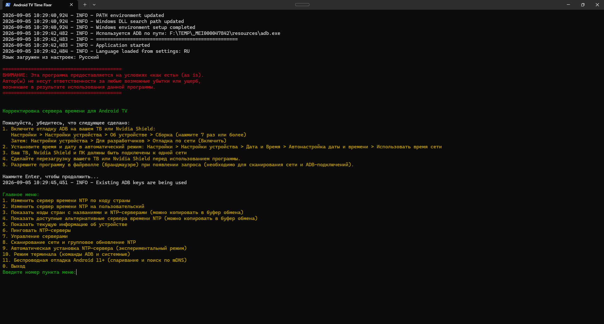

[English](https://github.com/civisrom/android-tv-date-time/blob/main/README_EN.md)

# Android TV Time Fixer

**Исправление проблем с синхронизацией времени на Android TV**

## Описание проблемы

Многие телевизоры и Android TV-приставки, особенно в регионах с сетевыми ограничениями, сталкиваются с проблемой сброса системных часов после отключения от электросети. Несмотря на включенную функцию автоматической синхронизации времени, устройство не может подключиться к серверу времени, что приводит к следующим последствиям:

*   **Потеря доступа к интернет-приложениям:** Многие приложения требуют точного времени для корректной работы.
*   **Необходимость ручной установки времени:** Пользователю приходится вручную выставлять время каждый раз после отключения устройства от питания.
*   **Сообщение "Подключено, без доступа к интернету" в настройках Wi-Fi:** Это индикатор того, что устройство не может синхронизировать время с сервером.

**Причина:** Основной причиной является невозможность подключения устройства к стандартному NTP-серверу Google (`time.android.com`) из-за сетевых ограничений в указанных регионах.

**Решение:** Android TV Time Fixer позволяет решить эту проблему, заменяя стандартный NTP-сервер Google на альтернативный, доступный в вашем регионе.

## О программе

**Android TV Time Fixer** — это кроссплатформенная утилита для Windows, Linux и macOS, предназначенная для управления настройками NTP-сервера на устройствах Android TV через ADB (Android Debug Bridge).

Начиная с версии 2.5.0 у проекта две половины:

*   **Программа для компьютера** — полнофункциональная консольная утилита,
    описанная ниже. Windows, Linux, macOS.
*   **Приложение для Android (APK, экспериментальное)** — то же самое с
    телефона или планшета, без компьютера вообще. См. раздел
    [Приложение для Android](#приложение-для-android).

## Скриншоты



## Основные возможности

*   **Многоязычный интерфейс:**
    *   Поддержка русского и английского языков
    *   Выбор языка при запуске программы
    *   Автоматическое сохранение и загрузка выбранного языка

*   **Изменение NTP-сервера:**
    *   Автоматическая установка по коду страны (65+ стран)
    *   Установка пользовательского NTP-сервера
    *   Валидация введённых данных (доменные имена и IP-адреса)
    *   Проверка доступности NTP-сервера перед применением
    *   Интерактивные подсказки и поиск по названию страны

*   **Просмотр информации:**
    *   Список доступных кодов стран с названиями и NTP-серверов
    *   Список альтернативных NTP-серверов (региональные пулы, Cloudflare, Google и др.)
    *   Интерактивный поиск по коду или названию страны

*   **Детальная информация об устройстве:**
    *   Модель и производитель
    *   Версия Android и API level
    *   Серийный номер
    *   Архитектура процессора и количество ядер
    *   Объём оперативной памяти
    *   Разрешение экрана и плотность
    *   Сетевые параметры (IP, MAC-адрес)
    *   Текущий NTP-сервер
    *   Статус батареи, часовой пояс, локаль
    *   Время работы устройства (uptime)
    *   Сравнение времени устройства и ПК

*   **Управление серверами:**
    *   Избранные серверы (добавление, удаление, просмотр)
    *   Копирование/вставка серверов из буфера обмена
    *   Пинг всех доступных NTP-серверов (110+)
    *   Отображение времени отклика (RTT)
    *   Процент успешных подключений
    *   Сортировка по доступности и скорости
    *   Экспорт/импорт настроек в JSON

*   **Беспроводная отладка Android 11+ (новое):**
    *   Спаривание с устройством по 6-значному коду прямо из программы
    *   Поиск устройств по mDNS — не нужно знать ни IP, ни порт
    *   Автоматическое определение протокола: программа сама понимает, работает
        устройство по старой «отладке по сети» или по новой шифрованной
    *   Работа с Google TV Streamer и Chromecast with Google TV на Android 14,
        где старая «отладка по сети» уже недоступна
    *   Собственный ADB-сервер: программа не мешает вашему `adb` и Android Studio
    *   **Linux и macOS:** ADB-ключи и список спаренных устройств хранятся
        рядом с программой, так что она не трогает ваш `~/.android`
        (на Windows `adb` определяет профиль через системный API и такую
        изоляцию не поддерживает)

*   **Сканирование сети и групповые операции:**
    *   Автоматическое сканирование локальной сети на устройства Android TV
    *   Настраиваемый ADB-порт сканирования (по умолчанию 5555)
    *   Подключение к найденным устройствам
    *   Групповое обновление NTP-сервера на нескольких устройствах
    *   Сравнение времени устройства с ПК (синхронизация)

*   **Автоматическая установка NTP (экспериментальный режим):**
    *   Полная автоматизация: сканирование сети → подключение → выбор лучшего NTP → установка
    *   Быстрая проверка всех NTP-серверов с выбором оптимального по RTT
    *   Топ-5 самых быстрых серверов с возможностью выбора

*   **Режим терминала:**
    *   Выполнение любых ADB-команд
    *   Выполнение системных команд
    *   Встроенная справка по командам ADB
    *   Управление приложениями, файлами, перезагрузка устройства

*   **Приложение для Android (новое, экспериментальное):**
    *   Отдельный APK: смена NTP-сервера прямо с телефона, компьютер не нужен
    *   Один файл на два сценария — с телефона по сети на телевизор либо
        установка на сам Android TV
    *   Спаривание по 6-значному коду для беспроводной отладки Android 11+
    *   Поиск устройств в сети по mDNS: ни IP, ни порт знать не нужно
    *   Тот же справочник NTP-серверов, что и в десктопной версии — он
        генерируется из одного общего файла, расхождение невозможно:
        77 стран и 45 альтернативных серверов
    *   Проверка адреса **как сервера времени**, а не просто на доступность:
        приложение шлёт настоящий SNTP-запрос и смотрит на ответ
    *   Подбор самого быстрого сервера перебором всего справочника
    *   Адрес можно задать и доменным именем, и IP
    *   Проверка результата чтением: значение перечитывается с устройства,
        а не берётся из кода возврата `settings put`
    *   Сведения об устройстве: модель, Android, память, экран, uptime и прочее
    *   Интерфейс на русском и английском по языку системы

*   **Дополнительные функции:**
    *   Сохранение последнего использованного IP-адреса
    *   Копирование серверов в буфер обмена
    *   Автоматическая генерация ADB-ключей
    *   Переиспользование существующих подключений
    *   Подробное логирование в файл
    *   Предупреждение о необходимости разрешения в файрволле

## Установка

### Windows

1.  Скачайте архив `AndroidTVTimeFixer-windows.zip` из раздела [Releases](https://github.com/civisrom/android-tv-date-time/releases).
2.  Распакуйте архив в удобное место на вашем компьютере, например, `D:\AndroidTVTimeFixer`.
3.  Запустите `AndroidTVTimeFixer.exe` или используйте `start.bat` / `start.ps1`.

Запуск через **PowerShell**

1.  Откройте **PowerShell** от имени администратора.
2.  Перейдите в папку с программой:
    ```powershell
    cd "D:\AndroidTVTimeFixer"
    ```
3.  Запустите программу:
    ```powershell
    .\AndroidTVTimeFixer.exe
    ```

### Linux

1.  Скачайте архив `AndroidTVTimeFixer-linux.zip` из раздела [Releases](https://github.com/civisrom/android-tv-date-time/releases).
2.  Распакуйте архив:
    ```bash
    unzip AndroidTVTimeFixer-linux.zip
    ```
3.  Сделайте файл исполняемым и запустите:
    ```bash
    chmod +x AndroidTVTimeFixer
    ./AndroidTVTimeFixer
    ```

### macOS

1.  Скачайте архив `AndroidTVTimeFixer-macos.zip` из раздела [Releases](https://github.com/civisrom/android-tv-date-time/releases).
2.  Распакуйте архив и запустите приложение.

### Android (APK)

1.  Скачайте `AndroidTVTimeFixer-2.5.0.apk` из раздела [Releases](https://github.com/civisrom/android-tv-date-time/releases).
2.  Сверьте контрольную сумму с файлом `.apk.sha256` рядом:
    ```bash
    sha256sum -c AndroidTVTimeFixer-2.5.0.apk.sha256
    ```
3.  Установите:
    *   **На телефон** — откройте файл и разрешите установку из неизвестных
        источников для файлового менеджера или браузера.
    *   **На сам Android TV** — либо через `adb install AndroidTVTimeFixer-2.5.0.apk`
        с компьютера, либо любым файловым менеджером на телевизоре. Иконка
        появится и в обычном лаунчере, и в лаунчере Android TV.

Требуется **Android 6.0** или новее. Подробности — в разделе
[Приложение для Android](#приложение-для-android).

**Про предупреждение Google Play Защиты.** При установке APK не из Google Play
система показывает «Приложение заблокировано для защиты устройства» с пояснением,
что Play Защита никогда не проверяла приложения этого разработчика. Это
ожидаемое поведение для **любого** стороннего APK, а не признак проблемы:
приложение не публикуется в Google Play. Нажмите «Все равно установить».
Подлинность файла проверяется контрольной суммой из шага 2 и подписью APK.

### Данные приложения

Программа переносимая: ADB-ключи, настройки и журнал хранятся **рядом с исполняемым файлом**
(`keys/`, `adb/`, `settings.json`, `saved_servers.json`, `android_tv_fixer.log`).

- `keys/` — ключ для прямого подключения по «отладке по сети» (старый протокол ADB).
- `adb/` — собственный каталог `adb` для беспроводной отладки Android 11+: там
  лежат ключ и список спаренных устройств. При первом запуске существующие ключи
  из `~/.android` копируются сюда, чтобы уже спаренные устройства продолжили
  работать. **Только Linux и macOS:** на Windows `adb` определяет профиль
  пользователя через системный API и игнорирует переменные окружения, поэтому
  его ключи там остаются в `%USERPROFILE%\.android` (проверено на
  platform-tools 37.0.1).

Собственный порт ADB-сервера программа использует на **всех** платформах,
поэтому она не мешает вашему `adb` и Android Studio и не завершает их сессии.

Если в папку программы писать нельзя (например, установка в `Program Files` или запуск
прямо из архива), данные автоматически уходят в каталог пользователя:

- Windows: `%LOCALAPPDATA%\AndroidTVTimeFixer`
- Linux: `$XDG_DATA_HOME/AndroidTVTimeFixer` или `~/.local/share/AndroidTVTimeFixer`
- macOS: `~/Library/Application Support/AndroidTVTimeFixer`

В этом случае при первом запуске существующие настройки и ADB-ключи из папки программы
копируются автоматически.

## Подготовка Android TV

### Шаг 1. Включите режим разработчика

1.  Откройте на вашем Android TV: **Настройки** > **Настройки устройства** > **Об устройстве**.
2.  Нажмите 7 раз на пункт **"Сборка"**, чтобы разблокировать режим разработчика.
3.  Перейдите: **Настройки устройства** > **Для разработчиков**.

### Шаг 2. Включите отладку — один из двух вариантов

В разделе «Для разработчиков» найдите **один** из этих пунктов. Какой именно
доступен — зависит от прошивки, а не от версии Android.

**Вариант А — «Отладка по сети» (классический).** Есть на большинстве
телевизоров и приставок: Xiaomi, TCL, Nvidia Shield, Fire TV. Просто включите
переключатель. Устройство начнёт слушать порт **5555**, и программе достаточно
его IP-адреса.

**Вариант Б — «Беспроводная отладка» (Android 11+).** Единственный вариант на
Google TV Streamer и Chromecast with Google TV после обновления до Android 14.
Включите переключатель и **оставьте экран открытым** — порты на нём случайные и
меняются. Дальше работайте через **пункт 11** главного меню (см. раздел
«Беспроводная отладка» ниже).

> Программа определяет вариант сама: достаточно ввести адрес, и она скажет,
> нужен ли код спаривания.

### Шаг 3. Разрешите автосинхронизацию времени

1.  Откройте: **Настройки** > **Дата и время**.
2.  Включите: **Автонастройка даты и времени** > **Использовать время сети**.

Без этого устройство не станет обращаться к NTP-серверу, который вы зададите.

### Шаг 4. После настройки

Для повышения безопасности рекомендуется отключить режим разработчика после
завершения настройки NTP-сервера. Заданный NTP-сервер сохраняется в системе и
переживает перезагрузку — отладка нужна только на время настройки.

## Главное меню

```
 1. Изменить сервер времени NTP по коду страны
 2. Изменить сервер времени NTP на пользовательский
 3. Показать коды стран с названиями и NTP-серверами (можно копировать в буфер обмена)
 4. Показать доступные альтернативные сервера времени NTP (можно копировать в буфер обмена)
 5. Показать текущую информацию об устройстве
 6. Пинговать NTP-серверы
 7. Управление серверами
 8. Сканирование сети и групповое обновление NTP
 9. Автоматическая установка NTP-сервера (экспериментальный режим)
10. Режим терминала (команды ADB и системные)
11. Беспроводная отладка Android 11+ (спаривание и поиск по mDNS)
 0. Выход
```

### Подменю «Управление серверами»

```
1. Показать избранные серверы
2. Добавить текущий сервер в избранное
3. Копировать сервер в буфер обмена
4. Вставить сервер из буфера обмена
5. Удалить сервер из избранного
6. Пинговать NTP-серверы
7. Экспорт / Импорт настроек
8. Вернуться в главное меню
```

### Подменю «Беспроводная отладка»

```
1. Спарить устройство по коду
2. Найти устройства по mDNS
3. Вернуться в главное меню
```

### Подменю «Сканирование сети»

```
1. Сканировать локальную сеть на устройства Android TV
2. Подключиться к найденному устройству
3. Групповое обновление NTP (все найденные или введённые IP)
4. Статус синхронизации времени устройства
5. Назад в главное меню
```

### Подменю «Экспорт / Импорт настроек»

```
1. Экспортировать настройки в файл
2. Импортировать настройки из файла
3. Назад
```

## Как пользоваться программой

### Пункт 1 — Изменить сервер времени NTP по коду страны

Программа запрашивает адрес вашего устройства (телевизора или приставки) — можно ввести просто `192.168.1.20`, либо `192.168.1.20:37105`, если порт нестандартный, либо `s` для поиска в сети. Затем она подключается по ADB, показывает текущие настройки и предлагает ввести двухбуквенный код страны (например, `ru`, `by`, `de`). Можно ввести `?название` для поиска страны по названию. После выбора кода программа автоматически установит NTP-сервер соответствующего региона.

> **Подсказка:** Если вы не знаете код своей страны, сначала откройте **пункт 3** — там отображается полный список кодов стран с названиями и NTP-серверами. Скопируйте нужный код в буфер обмена и вставьте его при запросе в пункте 1.

### Пункт 2 — Изменить сервер времени NTP на пользовательский

Аналогично пункту 1, но вместо кода страны вы вводите адрес NTP-сервера вручную (доменное имя или IP-адрес). Программа проверит корректность формата и установит указанный сервер на устройство.

> **Подсказка:** Адрес NTP-сервера можно взять из **пункта 3** (серверы по странам) или **пункта 4** (альтернативные серверы — Cloudflare, Google и др.). Откройте нужный пункт, скопируйте адрес сервера в буфер обмена и вставьте его при запросе в пункте 2.

### Пункт 3 — Показать коды стран с названиями и NTP-серверами

Выводит полный список поддерживаемых кодов стран (65+), их названия и соответствующие NTP-серверы. Можно использовать интерактивный поиск. Результаты можно скопировать в буфер обмена.

> **Использование результатов:** Скопированный код страны можно вставить в **пункте 1**, а скопированный адрес NTP-сервера — в **пункте 2** при ручной настройке.

### Пункт 4 — Показать доступные альтернативные NTP-серверы

Показывает список альтернативных NTP-серверов: региональные пулы, Cloudflare, Google и другие. Результаты можно скопировать в буфер обмена.

> **Использование результатов:** Скопированный адрес сервера можно вставить в **пункте 2** для ручной установки на устройство.

### Пункт 5 — Показать текущую информацию об устройстве

Подключается к устройству и выводит подробную информацию: модель, производитель, версия Android, серийный номер, CPU, RAM, разрешение экрана, сетевые параметры (IP, MAC), текущий NTP-сервер, часовой пояс, аптайм, а также сравнение времени устройства и ПК.

### Пункт 6 — Пинговать NTP-серверы

Проверяет доступность всех известных NTP-серверов (110+). Показывает время отклика (RTT), процент успешных подключений, сортирует результаты по доступности и скорости.

### Пункт 7 — Управление серверами

Открывает подменю для работы с избранными серверами:
- **Показать избранные** — список сохранённых серверов
- **Добавить текущий сервер** — сохраняет текущий NTP-сервер устройства в избранное
- **Копировать сервер** — копирует текущий сервер устройства в буфер обмена
- **Вставить сервер** — устанавливает на устройство сервер из буфера обмена
- **Удалить сервер** — удаляет выбранный сервер из списка избранного
- **Экспорт / Импорт настроек** — сохранение и восстановление всех настроек (язык, IP, избранные серверы) в JSON-файл

### Пункт 8 — Сканирование сети и групповое обновление NTP

Открывает подменю для работы с несколькими устройствами:
- **Сканировать сеть** — сначала спрашивает ADB-порт (Enter — 5555, значение запоминается), затем находит устройства Android TV в локальной сети. Найденные адреса показываются в виде `IP:порт`, так что нестандартный порт дальше подставляется сам
- **Подключиться к найденному устройству** — выбрать и подключиться к одному из обнаруженных устройств
- **Групповое обновление NTP** — установить NTP-сервер сразу на все найденные или вручную введённые устройства
- **Статус синхронизации времени** — сравнить время устройства с временем ПК

### Пункт 9 — Автоматическая установка NTP-сервера (экспериментальный режим)

Полностью автоматический режим:
1. Спрашивает ADB-порт и сканирует локальную сеть, находя устройства Android TV
2. Подключается к выбранному устройству
3. Определяет ваш регион по часовому поясу системы
4. Проверяет все доступные NTP-серверы (110+) и измеряет скорость отклика
5. Показывает Топ-5 самых быстрых серверов с RTT, процентом успешности и смещением
6. Автоматически рекомендует лучший сервер
7. Устанавливает выбранный сервер на устройство

### Пункт 10 — Режим терминала

Интерактивный режим для выполнения любых ADB и системных команд. Полезен для продвинутых пользователей:
- Управление приложениями (установка, удаление)
- Передача файлов (push/pull)
- Снимки экрана и запись видео
- Диагностика системы
- Перезагрузка устройства

Команды: `help` — справка, `clear` — очистка экрана, `exit` — выход из терминала.

### Пункт 11 — Беспроводная отладка Android 11+

Этот пункт нужен, если на устройстве в разделе «Для разработчиков» есть
**«Беспроводная отладка»** вместо «Отладки по сети» — так устроены Google TV
Streamer и Chromecast with Google TV на Android 14.

Открывает подменю из двух действий.

**1. Спарить устройство по коду.** Однократная процедура: после неё компьютер
и телевизор знают друг друга, и повторять её не нужно.

1.  На телевизоре: **Для разработчиков** > **Беспроводная отладка** >
    **Подключение с помощью кода**. На экране появятся адрес, порт и
    6-значный код.
2.  В программе выберите пункт 1. Она сама поищет устройства по mDNS и покажет
    список — выберите номером. Если mDNS недоступен, введите адрес вручную в
    виде `192.168.1.20:41234` (порт **спаривания** с экрана телевизора).
3.  Введите 6-значный код.
4.  После успешного спаривания программа спросит адрес для подключения.
    **Внимание: это другой порт.** Он показан на основном экране «Беспроводная
    отладка», а не в окне спаривания. Через mDNS программа подставит его сама.

**2. Найти устройства по mDNS.** Показывает две группы: устройства, ожидающие
спаривания (у них на экране открыт диалог с кодом), и уже спаренные, готовые к
подключению. Из второй группы можно сразу подключиться, выбрав номер.

> **Почему без mDNS неудобно.** Беспроводная отладка выдаёт **случайные** порты,
> причём для спаривания и для подключения — разные, и они меняются при каждом
> включении. Обнаружение по mDNS избавляет от их переписывания с экрана.
> Программа сначала пробует встроенный `adb`, а если у него нет mDNS-бэкенда —
> библиотеку `zeroconf`. Если не работает ни то, ни другое, останется ручной
> ввод адреса.

После спаривания и подключения все остальные пункты меню работают как обычно:
смена NTP, информация об устройстве, терминал.

### Пункт 0 — Выход

Завершение работы программы.

## Приложение для Android

Отдельный APK, который делает то же самое, что десктопная программа, но с
телефона — или прямо с телевизора, на который установлен.

### Два режима

Приложение само определяет, где запущено, по типу интерфейса системы и
признаку leanback:

*   **Телефон или планшет** — управляет телевизором по сети, ровно как
    десктопная программа. Основной и рабочий сценарий.
*   **Сам Android TV** — пробует подключиться к собственному `adbd` по адресу
    `127.0.0.1:5555`. Это **гипотеза, а не гарантия**: не всякая прошивка
    принимает ADB-соединение с самой себя. Кнопка «Подключиться к этому
    устройству» отдельная именно поэтому — отказ должен быть виден, а не
    выглядеть поломкой.

### Что умеет

*   Подключение по адресу вида `192.168.1.20` или `192.168.1.20:37105`.
*   Спаривание по 6-значному коду (беспроводная отладка Android 11+).
    Порт спаривания и порт подключения **разные** — оба показаны на экране
    телевизора, и путаница между ними самая частая причина неудачи.
*   Поиск устройств в локальной сети по mDNS: приложение показывает, какие
    устройства ждут спаривания, а какие готовы к подключению.
*   Выбор NTP-сервера по стране (поиск по коду или названию), из списка
    альтернативных серверов или вводом адреса вручную — доменным именем либо
    IP. Формат проверяется теми же правилами, что и в десктопной версии.
*   **Проверка сервера перед применением.** Приложение отправляет настоящий
    SNTP-запрос и разбирает ответ: адрес обязан ответить именно как сервер
    времени и сообщить время, близкое к настоящему (расхождение не больше
    60 секунд). Просто открытого порта недостаточно — иначе телевизор получил
    бы адрес, который «работает», а часы по нему не шли бы.
    Не прошедший проверку адрес по умолчанию не применяется, но остаётся
    кнопка «Применить всё-таки»: UDP-порт 123 закрывают и мобильные операторы,
    и часть домашних роутеров, и запрет наглухо оставил бы вас без выбора.
*   **Подбор самого быстрого сервера.** Проверяет весь справочник (122 адреса)
    и показывает пятёрку лучших с временем отклика и долей успешных ответов.
    Проверка идёт из сети телефона; её можно остановить в любой момент.
*   Сведения об устройстве: модель, производитель, версия Android и API,
    серийный номер, процессор и число ядер, память, экран и его плотность,
    часовой пояс, локаль, батарея, ядро, uptime, текущий NTP-сервер.

### Разрешения

Приложение просит доступ к устройствам поблизости. Это не про геолокацию:

*   с **Android 13** системный `NsdManager`, на котором работает mDNS, без
    `NEARBY_WIFI_DEVICES` возвращает **пустой список и не жалуется** —
    отличить это от «в сети никого нет» невозможно;
*   с **Android 17** без `ACCESS_LOCAL_NETWORK` рвутся соединения к адресам
    вида `192.168.x.x`, а приложение только в локальную сеть и ходит.

Отказ не ломает приложение: адрес всегда можно ввести руками, а кнопка
«Разрешить» остаётся на экране.

### Что ещё не проверено

Честный список — приложение **ни разу не запускалось на живом устройстве**:

*   Гипотеза loopback: примет ли прошивка телевизора соединение с самой себя.
*   Спаривание по коду и поиск по mDNS на реальном Android TV.
*   Смена NTP-сервера и то, переживает ли она перезагрузку.
*   Вид интерфейса и работа пульта (D-pad) на телевизоре.

Поэтому релиз с APK помечается как предварительный. Десктопной половины это
не касается: она проверена и стабильна.

## Совместимость

Программа протестирована и должна работать на устройствах Android TV (включая Nvidia Shield), которые соответствуют следующим требованиям:

*   Поддержка ADB по сети — в любом из двух вариантов: классическая
    «Отладка по сети» (порт 5555) или «Беспроводная отладка» Android 11+
    со спариванием по коду.
*   Поддержка управления NTP-сервером через команды `adb shell`.

Проверено на устройствах с Android от 9 до 16. На Google TV Streamer и
Chromecast with Google TV после обновления до Android 14 доступна только
беспроводная отладка — используйте пункт 11 меню.

**Поддерживаемые операционные системы:**
*   Windows 10/11
*   Linux (Ubuntu, Debian, Fedora и др.)
*   macOS

**Приложение для Android:** Android 6.0 и новее; для спаривания по коду —
Android 11 и новее на управляемом устройстве.

## Лицензия

Исходный код и десктопные сборки распространяются под лицензией
**Apache License 2.0** — полный текст в файле [LICENSE](LICENSE). Вы можете
свободно использовать, изменять и распространять их, в том числе в коммерческих
целях, при условии сохранения уведомления об авторских правах и указания
внесённых изменений.

**Готовый APK распространяется под GPL-3.0** — текст в файле
[LICENSE-GPL-3.0.txt](LICENSE-GPL-3.0.txt). Причина: в него линкуется
`spake2-java` под этой лицензией, без которого невозможно спаривание по коду на
Android 11+. Apache-2.0 совместима с GPL-3.0 в эту сторону, поэтому исходный код
проекта остаётся под Apache-2.0, а под GPL-3.0 попадает именно собранный APK.
Полный соответствующий исходный код — этот репозиторий на теге релиза.

### Сторонний код

Полный перечень — в [THIRD-PARTY-NOTICES.md](THIRD-PARTY-NOTICES.md). Кратко:

*   **Android Debug Bridge (`adb`)** — входит в релизные архивы, Apache-2.0,
    часть Android Open Source Project. Условия Android SDK явно выводят
    OSS-компоненты из-под своих ограничений, поэтому распространение идёт по
    Apache-2.0.
*   **Библиотеки Python** — Apache-2.0, BSD, MIT и PSF, все разрешительные.
*   **`spake2-java`** — **GPL-3.0**, приезжает вместе с `kadb-android` и
    отвечает за спаривание по коду. Только в APK; в десктопных сборках его нет.
*   **`kadb-android`, AndroidX, Compose, Kotlin** — Apache-2.0,
    **BouncyCastle и elisabeth** — MIT. Всё это только в APK.
*   **python-zeroconf** — **LGPL-2.1-or-later**, используется как запасной путь
    обнаружения по mDNS. Библиотека попадает внутрь готовых исполняемых файлов,
    поэтому LGPL требует дать возможность заменить её своей версией: инструкция
    по пересборке приведена в THIRD-PARTY-NOTICES.md. Импорт `zeroconf`
    необязательный — программа работает и без него, используя mDNS встроенного
    `adb`.

## Отказ от ответственности

**ВНИМАНИЕ: ВАЖНО ПРОЧИТАТЬ ПЕРЕД ИСПОЛЬЗОВАНИЕМ ПРОГРАММЫ**

Программа **Android TV Time Fixer** предоставляется на условиях **"как есть" (as is)**, без каких-либо гарантий, явных или подразумеваемых, включая, но не ограничиваясь, гарантии товарного качества, пригодности для конкретной цели и отсутствия нарушений прав.

**Отказ от ответственности за убытки:**

Автор(ы) и разработчики программы не несут ответственности за любые прямые, косвенные, случайные, специальные, штрафные или последующие убытки, включая, но не ограничиваясь, потерю данных, потерю прибыли, прерывание бизнеса, ущерб имуществу или любой другой ущерб, возникающий в результате использования или невозможности использования данной программы, даже если автор(ы) были предупреждены о возможности таких убытков.

**Отказ от гарантий:**

Мы не гарантируем, что:

*   Программа будет соответствовать вашим требованиям.
*   Работа программы будет бесперебойной и безошибочной.
*   Любые дефекты программы будут исправлены.
*   Использование программы не приведет к каким-либо негативным последствиям для вашего устройства или сети.
*   Программа будет совместима со всеми устройствами и версиями Android TV.
*   Программа будет работать корректно во всех регионах и сетях, включая регионы с сетевыми ограничениями.

**Согласие с условиями:**

Используя программу **Android TV Time Fixer**, вы:

*   **Соглашаетесь с условиями настоящего отказа от ответственности.**
*   **Принимаете на себя все риски**, связанные с использованием программы.
*   **Освобождаете автора(ов) и разработчиков от любой ответственности** за любые убытки или ущерб, которые могут возникнуть в результате использования программы.

**Изменения:**

Автор(ы) оставляют за собой право в любое время вносить изменения в данный отказ от ответственности без предварительного уведомления. Ваше дальнейшее использование программы после внесения изменений будет означать ваше согласие с измененными условиями.
