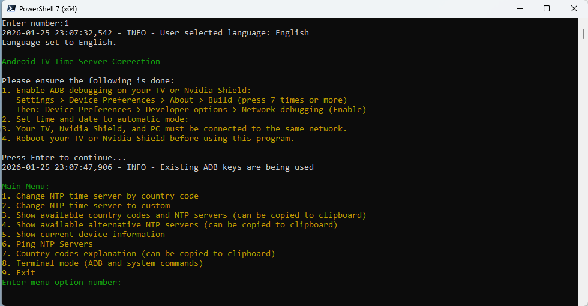

[Русский](https://github.com/civisrom/android-tv-date-time/blob/main/README.md)

# Android TV Time Fixer

**Fixing Time Synchronization Issues on Android TV**

## Problem Description

Many televisions and Android TV boxes, particularly in regions with network restrictions, experience system clock resets after being disconnected from the power supply. Despite having the automatic time synchronization feature enabled, the device fails to connect to a time server, leading to the following consequences:

*   **Loss of access to internet applications:** Many applications require accurate time for proper functioning.
*   **Necessity of manual time setting:** Users have to manually set the time each time after the device is disconnected from power.
*   **"Connected, no internet access" message in Wi-Fi settings:** This indicates that the device is unable to synchronize time with the server.

**Reason:** The primary reason is the inability of the device to connect to the standard Google NTP server (`time.android.com`) due to network restrictions in those regions.

**Solution:** Android TV Time Fixer resolves this problem by replacing the standard Google NTP server with an alternative one available in your region.

## About the Program

**Android TV Time Fixer** is a cross-platform utility for Windows, Linux, and macOS, designed to manage NTP server settings on Android TV devices via ADB (Android Debug Bridge).

## Screenshots




## Key Features

*   **Multilingual Interface:**
    *   Support for English and Russian languages
    *   Language selection at program startup

*   **NTP Server Modification:**
    *   Automatic setup by country code (65+ countries)
    *   Manual setup of a custom NTP server
    *   Input validation

*   **Information Display:**
    *   List of available country codes and NTP servers
    *   List of alternative NTP servers (regional pools, Cloudflare, Google, etc.)
    *   Country code descriptions

*   **Detailed Device Information:**
    *   Model and manufacturer
    *   Android version and API level
    *   Serial number
    *   CPU architecture and core count
    *   RAM capacity
    *   Screen resolution
    *   Network parameters (IP, MAC address)
    *   Current NTP server
    *   And much more

*   **NTP Server Testing:**
    *   Ping all available NTP servers (110+)
    *   Display response time (RTT)
    *   Success rate percentage
    *   Sorting by availability and speed

*   **Terminal Mode:**
    *   Execute any ADB commands
    *   Execute system commands
    *   Built-in ADB command reference
    *   App management, file operations, device reboot

*   **Additional Features:**
    *   Save last used IP address
    *   Copy servers to clipboard
    *   Automatic ADB key generation
    *   Detailed file logging

## Installation and Usage

### Windows

1.  Download the `AndroidTVTimeFixer-windows.zip` archive from the [Releases](https://github.com/civisrom/android-tv-date-time/releases) section.
2.  Extract the archive to a convenient location on your computer, for example, `D:\AndroidTVTimeFixer`.
3.  Run `AndroidTVTimeFixer.exe`.

Run via PowerShell

1.  Open **PowerShell** as an administrator.
2.  Navigate to the program's folder:
    ```powershell
    cd "D:\AndroidTVTimeFixer"
    ```
3.  Run the program:
    ```powershell
    .\AndroidTVTimeFixer.exe
    ```

### Linux

1.  Download the `AndroidTVTimeFixer-linux.zip` archive from the [Releases](https://github.com/civisrom/android-tv-date-time/releases) section.
2.  Extract the archive:
    ```bash
    unzip AndroidTVTimeFixer-linux.zip
    cd AndroidTVTimeFixer-linux
    ```
3.  Make the file executable and run:
    ```bash
    chmod +x AndroidTVTimeFixer
    ./AndroidTVTimeFixer
    ```

### macOS

1.  Download the `AndroidTVTimeFixer-macos.zip` archive from the [Releases](https://github.com/civisrom/android-tv-date-time/releases) section.
2.  Extract the archive and run the application.

## Android TV Setup

### Enabling ADB Debugging (Developer Mode)

1.  On your Android TV, open: **Settings** > **Device Preferences** > **About**.
2.  Click on the **"Build"** item 7 times to unlock developer mode.
3.  Go to: **Device Preferences** > **Developer options**.
4.  Enable **"Network Debugging"**.
5.  Open: **Settings** > **Date & Time**.
6.  Enable: **Auto date & time** > **Use network time**.
7.  For enhanced security, it is recommended to disable developer mode after completing the NTP server configuration.

## Main Menu

```
1. Change NTP time server by country code
2. Change NTP time server to custom
3. Show available country codes and NTP servers
4. Show available alternative NTP servers
5. Show current device information
6. Ping NTP servers
7. Country codes explanation
8. Terminal mode (ADB and system commands)
9. Exit
```

## Compatibility

The program has been tested and should work on Android TV devices (including Nvidia Shield) that meet the following requirements:

*   Support for ADB connections over the network.
*   Support for NTP server management via `adb shell` commands.

**Supported Operating Systems:**
*   Windows 10/11
*   Linux (Ubuntu, Debian, Fedora, etc.)
*   macOS

## Disclaimer

**WARNING: IMPORTANT TO READ BEFORE USING THE PROGRAM**

The **Android TV Time Fixer** program is provided on an **"as is"** basis, without any warranties, express or implied, including but not limited to warranties of merchantability, fitness for a particular purpose, and non-infringement.

**Disclaimer of Liability for Losses:**

The author(s) and developers of the program shall not be liable for any direct, indirect, incidental, special, punitive, or consequential damages, including but not limited to loss of data, loss of profits, business interruption, property damage, or any other damages arising from the use or inability to use this program, even if the author(s) have been advised of the possibility of such damages.

**Disclaimer of Warranties:**

We do not warrant that:

*   The program will meet your requirements.
*   The operation of the program will be uninterrupted and error-free.
*   Any defects in the program will be corrected.
*   The use of the program will not lead to any adverse consequences for your device or network.
*   The program will be compatible with all devices and versions of Android TV.
*   The program will operate correctly in all regions and networks, including regions with network restrictions.

**Agreement to Terms:**

By using the **Android TV Time Fixer** program, you:

*   **Agree to the terms of this disclaimer.**
*   **Assume all risks** associated with the use of the program.
*   **Release the author(s) and developers from any liability** for any losses or damages that may arise from the use of the program.

**Changes:**

The author(s) reserve the right to make changes to this disclaimer at any time without prior notice. Your continued use of the program after any changes are made will signify your acceptance of the modified terms.
