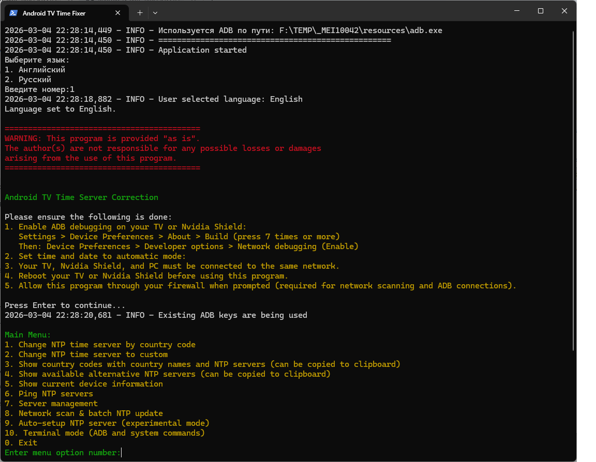

[Русский](https://github.com/civisrom/android-tv-date-time/blob/main/README.md)

# Android TV Time Fixer

**Fixing Time Synchronization Issues on Android TV**

## Problem Description

Many televisions and Android TV boxes, particularly in regions with network restrictions, experience system clock resets after being disconnected from the power supply. Despite having the automatic time synchronization feature enabled, the device fails to connect to a time server, leading to the following consequences:

*   **Loss of access to internet applications:** Many applications require accurate time for proper functioning.
*   **Necessity of manual time setting:** Users have to manually set the time each time after the device is disconnected from power.
*   **"Connected, no internet access" message in Wi-Fi settings:** This indicates that the device is unable to synchronize time with the server.

**Reason:** The primary reason is the inability of the device to connect to the standard Google NTP server (`time.android.com`) due to network restrictions in those regions.

**Solution:** Android TV Time Fixer resolves this problem by replacing the standard Google NTP server with an alternative one available in your region.

## About the Program

**Android TV Time Fixer** is a cross-platform utility for Windows, Linux, and macOS, designed to manage NTP server settings on Android TV devices via ADB (Android Debug Bridge).

## Screenshots



## Key Features

*   **Multilingual Interface:**
    *   Support for English and Russian languages
    *   Language selection at program startup
    *   Automatic saving and loading of selected language

*   **NTP Server Modification:**
    *   Automatic setup by country code (65+ countries)
    *   Manual setup of a custom NTP server
    *   Input validation (domain names and IP addresses)
    *   NTP server availability check before applying
    *   Interactive hints and country name search

*   **Information Display:**
    *   List of available country codes with names and NTP servers
    *   List of alternative NTP servers (regional pools, Cloudflare, Google, etc.)
    *   Interactive search by code or country name

*   **Detailed Device Information:**
    *   Model and manufacturer
    *   Android version and API level
    *   Serial number
    *   CPU architecture and core count
    *   RAM capacity
    *   Screen resolution and density
    *   Network parameters (IP, MAC address)
    *   Current NTP server
    *   Battery status, timezone, locale
    *   Device uptime
    *   Comparison of device time vs PC time

*   **Server Management:**
    *   Favorite servers (add, remove, view)
    *   Copy/paste servers to/from clipboard
    *   Ping all available NTP servers (110+)
    *   Display response time (RTT)
    *   Success rate percentage
    *   Sorting by availability and speed
    *   Export/import settings to JSON

*   **Network Scan & Batch Operations:**
    *   Automatic local network scanning for Android TV devices
    *   Detection of devices with open ADB port 5555
    *   Connect to discovered devices
    *   Batch NTP server update across multiple devices
    *   Device time vs PC time comparison (sync status)

*   **Auto-setup NTP (Experimental Mode):**
    *   Full automation: network scan → connect → select best NTP → install
    *   Quick test of all NTP servers with optimal selection by RTT
    *   Top-5 fastest servers with choice option

*   **Terminal Mode:**
    *   Execute any ADB commands
    *   Execute system commands
    *   Built-in ADB command reference
    *   App management, file operations, device reboot

*   **Additional Features:**
    *   Save last used IP address
    *   Copy servers to clipboard
    *   Automatic ADB key generation
    *   Connection reuse for existing connections
    *   Detailed file logging
    *   Firewall permission notice

## Installation

### Windows

1.  Download the `AndroidTVTimeFixer-windows.zip` archive from the [Releases](https://github.com/civisrom/android-tv-date-time/releases) section.
2.  Extract the archive to a convenient location on your computer, for example, `D:\AndroidTVTimeFixer`.
3.  Run `AndroidTVTimeFixer.exe` or use `start.bat` / `start.ps1`.

Run via PowerShell

1.  Open **PowerShell** as an administrator.
2.  Navigate to the program's folder:
    ```powershell
    cd "D:\AndroidTVTimeFixer"
    ```
3.  Run the program:
    ```powershell
    .\AndroidTVTimeFixer.exe
    ```

### Linux

1.  Download the `AndroidTVTimeFixer-linux.zip` archive from the [Releases](https://github.com/civisrom/android-tv-date-time/releases) section.
2.  Extract the archive:
    ```bash
    unzip AndroidTVTimeFixer-linux.zip
    ```
3.  Make the file executable and run:
    ```bash
    chmod +x AndroidTVTimeFixer
    ./AndroidTVTimeFixer
    ```

### macOS

1.  Download the `AndroidTVTimeFixer-macos.zip` archive from the [Releases](https://github.com/civisrom/android-tv-date-time/releases) section.
2.  Extract the archive and run the application.

## Android TV Setup

### Enabling ADB Debugging (Developer Mode)

1.  On your Android TV, open: **Settings** > **Device Preferences** > **About**.
2.  Click on the **"Build"** item 7 times to unlock developer mode.
3.  Go to: **Device Preferences** > **Developer options**.
4.  Enable **"Network Debugging"**.
5.  Open: **Settings** > **Date & Time**.
6.  Enable: **Auto date & time** > **Use network time**.
7.  For enhanced security, it is recommended to disable developer mode after completing the NTP server configuration.

## Main Menu

```
 1. Change NTP time server by country code
 2. Change NTP time server to custom
 3. Show country codes with country names and NTP servers (can be copied to clipboard)
 4. Show available alternative NTP servers (can be copied to clipboard)
 5. Show current device information
 6. Ping NTP servers
 7. Server management
 8. Network scan & batch NTP update
 9. Auto-setup NTP server (experimental mode)
10. Terminal mode (ADB and system commands)
 0. Exit
```

### Server Management Submenu

```
1. Show favorite servers
2. Add current server to favorites
3. Copy server to clipboard
4. Paste server from clipboard
5. Remove server from favorites
6. Export / Import settings
7. Return to main menu
```

### Network Scan Submenu

```
1. Scan local network for Android TV devices
2. Connect to discovered device
3. Batch NTP update (all discovered or entered IPs)
4. Show device time sync status
5. Back to main menu
```

### Export / Import Settings Submenu

```
1. Export settings to file
2. Import settings from file
3. Back
```

## How to Use the Program

### Item 1 — Change NTP time server by country code

The program asks for the IP address of your device (TV or set-top box), connects to it via ADB, shows current settings, and prompts you to enter a two-letter country code (e.g., `ru`, `ua`, `de`). You can type `?name` to search for a country by name. After selecting a code, the program will automatically set the NTP server for that region.

> **Tip:** If you don't know your country code, first open **item 3** — it displays a full list of country codes with names and NTP servers. Copy the desired code to the clipboard and paste it when prompted in item 1.

### Item 2 — Change NTP time server to custom

Similar to item 1, but instead of a country code you enter an NTP server address manually (domain name or IP address). The program will validate the format and set the specified server on the device.

> **Tip:** You can get the NTP server address from **item 3** (servers by country) or **item 4** (alternative servers — Cloudflare, Google, etc.). Open the desired item, copy the server address to the clipboard, and paste it when prompted in item 2.

### Item 3 — Show country codes with country names and NTP servers

Displays a complete list of supported country codes (65+), their names, and corresponding NTP servers. Interactive search is available. Results can be copied to the clipboard.

> **Using the results:** The copied country code can be pasted into **item 1**, and the copied NTP server address can be pasted into **item 2** for manual setup.

### Item 4 — Show available alternative NTP servers

Shows a list of alternative NTP servers: regional pools, Cloudflare, Google, and others. Results can be copied to the clipboard.

> **Using the results:** The copied server address can be pasted into **item 2** for manual installation on the device.

### Item 5 — Show current device information

Connects to the device and displays detailed information: model, manufacturer, Android version, serial number, CPU, RAM, screen resolution, network parameters (IP, MAC), current NTP server, timezone, uptime, and a comparison of device time vs PC time.

### Item 6 — Ping NTP servers

Tests availability of all known NTP servers (110+). Shows response time (RTT), connection success rate, and sorts results by availability and speed.

### Item 7 — Server management

Opens a submenu for managing favorite servers:
- **Show favorites** — list of saved servers
- **Add current server** — saves the current NTP server from the device to favorites
- **Copy server** — copies the current device server to clipboard
- **Paste server** — sets the server from clipboard on the device
- **Remove server** — removes a selected server from the favorites list
- **Export / Import settings** — save and restore all settings (language, IP, favorite servers) to a JSON file

### Item 8 — Network scan & batch NTP update

Opens a submenu for working with multiple devices:
- **Scan network** — automatically discovers Android TV devices on the local network via open ADB port 5555
- **Connect to discovered device** — select and connect to one of the found devices
- **Batch NTP update** — set an NTP server on all discovered or manually entered devices at once
- **Time sync status** — compare device time with PC time

### Item 9 — Auto-setup NTP server (experimental mode)

Fully automatic mode:
1. Scans the local network and discovers Android TV devices
2. Connects to the selected device
3. Detects your region based on the system timezone
4. Tests all available NTP servers (110+) and measures response times
5. Shows the Top-5 fastest servers with RTT, success rate, and offset
6. Automatically recommends the best server
7. Installs the selected server on the device

### Item 10 — Terminal mode

Interactive mode for executing any ADB and system commands. Useful for advanced users:
- App management (install, uninstall)
- File transfers (push/pull)
- Screenshots and screen recording
- System diagnostics
- Device reboot

Commands: `help` — help, `clear` — clear screen, `exit` — exit terminal mode.

### Item 0 — Exit

Closes the program.

## Compatibility

The program has been tested and should work on Android TV devices (including Nvidia Shield) that meet the following requirements:

*   Support for ADB connections over the network.
*   Support for NTP server management via `adb shell` commands.

**Supported Operating Systems:**
*   Windows 10/11
*   Linux (Ubuntu, Debian, Fedora, etc.)
*   macOS

## Disclaimer

**WARNING: IMPORTANT TO READ BEFORE USING THE PROGRAM**

The **Android TV Time Fixer** program is provided on an **"as is"** basis, without any warranties, express or implied, including but not limited to warranties of merchantability, fitness for a particular purpose, and non-infringement.

**Disclaimer of Liability for Losses:**

The author(s) and developers of the program shall not be liable for any direct, indirect, incidental, special, punitive, or consequential damages, including but not limited to loss of data, loss of profits, business interruption, property damage, or any other damages arising from the use or inability to use this program, even if the author(s) have been advised of the possibility of such damages.

**Disclaimer of Warranties:**

We do not warrant that:

*   The program will meet your requirements.
*   The operation of the program will be uninterrupted and error-free.
*   Any defects in the program will be corrected.
*   The use of the program will not lead to any adverse consequences for your device or network.
*   The program will be compatible with all devices and versions of Android TV.
*   The program will operate correctly in all regions and networks, including regions with network restrictions.

**Agreement to Terms:**

By using the **Android TV Time Fixer** program, you:

*   **Agree to the terms of this disclaimer.**
*   **Assume all risks** associated with the use of the program.
*   **Release the author(s) and developers from any liability** for any losses or damages that may arise from the use of the program.

**Changes:**

The author(s) reserve the right to make changes to this disclaimer at any time without prior notice. Your continued use of the program after any changes are made will signify your acceptance of the modified terms.
