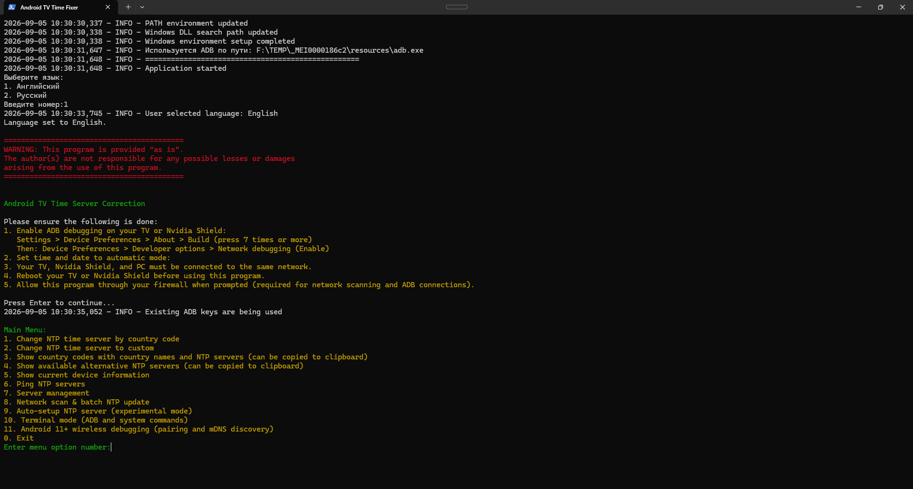

[Русский](https://github.com/civisrom/android-tv-date-time/blob/main/README.md)

# Android TV Time Fixer

**Fixing Time Synchronization Issues on Android TV**

## Problem Description

Many televisions and Android TV boxes, particularly in regions with network restrictions, experience system clock resets after being disconnected from the power supply. Despite having the automatic time synchronization feature enabled, the device fails to connect to a time server, leading to the following consequences:

*   **Loss of access to internet applications:** Many applications require accurate time for proper functioning.
*   **Necessity of manual time setting:** Users have to manually set the time each time after the device is disconnected from power.
*   **"Connected, no internet access" message in Wi-Fi settings:** This indicates that the device is unable to synchronize time with the server.

**Reason:** The primary reason is the inability of the device to connect to the standard Google NTP server (`time.android.com`) due to network restrictions in those regions.

**Solution:** Android TV Time Fixer resolves this problem by replacing the standard Google NTP server with an alternative one available in your region.

## About the Program

**Android TV Time Fixer** is a cross-platform utility for Windows, Linux, and macOS, designed to manage NTP server settings on Android TV devices via ADB (Android Debug Bridge).

As of version 2.6.0 the project has two halves:

*   **The desktop program** — the full-featured console utility described
    below. Windows, Linux, macOS.
*   **The Android application (APK, experimental)** — the same thing from a
    phone or tablet, with no computer involved at all. See
    [Android application](#android-application).

## Screenshots



## Key Features

*   **Multilingual Interface:**
    *   Support for English and Russian languages
    *   Language selection at program startup
    *   Automatic saving and loading of selected language

*   **NTP Server Modification:**
    *   Automatic setup by country code (65+ countries)
    *   Manual setup of a custom NTP server
    *   Input validation (domain names and IP addresses)
    *   NTP server availability check before applying
    *   Interactive hints and country name search

*   **Information Display:**
    *   List of available country codes with names and NTP servers
    *   List of alternative NTP servers (regional pools, Cloudflare, Google, etc.)
    *   Interactive search by code or country name

*   **Detailed Device Information:**
    *   Model and manufacturer
    *   Android version and API level
    *   Serial number
    *   CPU architecture and core count
    *   RAM capacity
    *   Screen resolution and density
    *   Network parameters (IP, MAC address)
    *   Current NTP server
    *   Battery status, timezone, locale
    *   Device uptime
    *   Comparison of device time vs PC time

*   **Server Management:**
    *   Favorite servers (add, remove, view)
    *   Copy/paste servers to/from clipboard
    *   Ping all available NTP servers (110+)
    *   Display response time (RTT)
    *   Success rate percentage
    *   Sorting by availability and speed
    *   Export/import settings to JSON

*   **Android 11+ wireless debugging (new):**
    *   Pair with a device using its 6-digit code, straight from the program
    *   mDNS discovery — you need neither the IP address nor the port
    *   Automatic protocol detection: the program works out on its own whether a
        device speaks the old network debugging or the new encrypted one
    *   Works with Google TV Streamer and Chromecast with Google TV on Android 14,
        where the old network debugging is no longer offered
    *   A private ADB server, so the program never disturbs your `adb` or Android Studio
    *   **Linux and macOS:** ADB keys and the list of paired devices are kept
        next to the program, so your `~/.android` is left alone (on Windows
        `adb` resolves the profile through a system API and does not support
        that isolation)

*   **Network Scan & Batch Operations:**
    *   Automatic local network scanning for Android TV devices
    *   Configurable ADB scan port (5555 by default)
    *   Connect to discovered devices
    *   Batch NTP server update across multiple devices
    *   Device time vs PC time comparison (sync status)

*   **Auto-setup NTP (Experimental Mode):**
    *   Full automation: network scan → connect → select best NTP → install
    *   Quick test of all NTP servers with optimal selection by RTT
    *   Top-5 fastest servers with choice option

*   **Terminal Mode:**
    *   Execute any ADB commands
    *   Execute system commands
    *   Built-in ADB command reference
    *   App management, file operations, device reboot

*   **Android application (new, experimental):**
    *   A separate APK: change the NTP server straight from a phone, no computer
    *   One file for two scenarios — from a phone to the TV over the network,
        or installed on the Android TV itself
    *   Full modern Wireless debugging support: 6-digit code pairing,
        persistent ADB identity and subsequent TLS connections
    *   mDNS discovery of separate pairing and connection services, with the
        correct dynamic port selected for each operation
    *   A guided "find TV → pair → connect → check NTP → apply → read back"
        workflow without a terminal or manually assembled ADB commands
    *   The same NTP server reference as the desktop version — both are
        generated from one shared file, so they cannot drift apart:
        77 countries and 45 alternative servers
    *   Servers are verified **as time servers**, not merely as reachable
        hosts: the app sends a real SNTP request and inspects the reply
    *   Finds the fastest server by testing the whole reference list
    *   An address can be a domain name or an IP
    *   The result is verified by reading it back, not taken from the exit code
        of `settings put`
    *   Device details: model, Android version, memory, screen, uptime and more
    *   Interface in Russian and English, following the system language

*   **Additional Features:**
    *   Save last used IP address
    *   Copy servers to clipboard
    *   Automatic ADB key generation
    *   Connection reuse for existing connections
    *   Detailed file logging
    *   Firewall permission notice

## Installation

### Windows

1.  Download the `AndroidTVTimeFixer-windows.zip` archive from the [Releases](https://github.com/civisrom/android-tv-date-time/releases) section.
2.  Extract the archive to a convenient location on your computer, for example, `D:\AndroidTVTimeFixer`.
3.  Run `AndroidTVTimeFixer.exe` or use `start.bat` / `start.ps1`.

Run via PowerShell

1.  Open **PowerShell** as an administrator.
2.  Navigate to the program's folder:
    ```powershell
    cd "D:\AndroidTVTimeFixer"
    ```
3.  Run the program:
    ```powershell
    .\AndroidTVTimeFixer.exe
    ```

### Linux

1.  Download the `AndroidTVTimeFixer-linux.zip` archive from the [Releases](https://github.com/civisrom/android-tv-date-time/releases) section.
2.  Extract the archive:
    ```bash
    unzip AndroidTVTimeFixer-linux.zip
    ```
3.  Make the file executable and run:
    ```bash
    chmod +x AndroidTVTimeFixer
    ./AndroidTVTimeFixer
    ```

### macOS

1.  Download the `AndroidTVTimeFixer-macos.zip` archive from the [Releases](https://github.com/civisrom/android-tv-date-time/releases) section.
2.  Extract the archive and run the application.

### Android (APK)

1.  Download `AndroidTVTimeFixer-2.6.1.apk` from [Releases](https://github.com/civisrom/android-tv-date-time/releases).
2.  Verify it against the `.apk.sha256` file next to it:
    ```bash
    sha256sum -c AndroidTVTimeFixer-2.6.1.apk.sha256
    ```
3.  Install it:
    *   **On a phone** — open the file and allow installation from unknown
        sources for your file manager or browser.
    *   **On the Android TV itself** — either `adb install AndroidTVTimeFixer-2.6.1.apk`
        from a computer, or any file manager on the TV. The icon appears both in
        the regular launcher and in the Android TV launcher.

Requires **Android 6.0** or newer. See
[Android application](#android-application) for details.

**About the Google Play Protect warning.** Installing an APK from outside
Google Play makes the system show "App blocked to protect your device", saying
Play Protect has never seen apps from this developer. That is expected for
**any** third-party APK and not a sign of trouble: this app is not published on
Google Play. Choose "Install anyway". The file's authenticity is established by
the checksum in step 2 and by the APK signature.

### Application data

The program is portable: ADB keys, settings, and the log live **next to the executable**
(`keys/`, `adb/`, `settings.json`, `saved_servers.json`, `android_tv_fixer.log`).

- `keys/` — the key for direct "network debugging" connections (legacy ADB protocol).
- `adb/` — a private `adb` home for Android 11+ wireless debugging: it holds the key
  and the list of paired devices. On the first run, existing keys from `~/.android` are
  copied here so that already paired devices keep working. **Linux and macOS only:** on
  Windows `adb` resolves the user profile through a system API and ignores environment
  variables, so its keys stay in `%USERPROFILE%\.android` there (verified against
  platform-tools 37.0.1).

The program uses its own ADB server port on **every** platform, so it never interferes
with your `adb` or Android Studio and never kills their sessions.

When the program folder is not writable (installed under `Program Files`, or launched
straight from an archive), the data falls back to the user data directory:

- Windows: `%LOCALAPPDATA%\AndroidTVTimeFixer`
- Linux: `$XDG_DATA_HOME/AndroidTVTimeFixer` or `~/.local/share/AndroidTVTimeFixer`
- macOS: `~/Library/Application Support/AndroidTVTimeFixer`

In that case, existing settings and ADB keys from the application folder are copied
automatically on first launch.

## Android TV Setup

### Step 1. Enable developer mode

1.  On your Android TV, open: **Settings** > **Device Preferences** > **About**.
2.  Click on the **"Build"** item 7 times to unlock developer mode.
3.  Go to: **Device Preferences** > **Developer options**.

### Step 2. Enable debugging — one of two ways

Look for **one** of these entries under Developer options. Which one you get
depends on the firmware, not on the Android version.

**Option A — "Network debugging" (classic).** Present on most TVs and boxes:
Xiaomi, TCL, Nvidia Shield, Fire TV. Just turn the switch on. The device starts
listening on port **5555**, and the program only needs its IP address.

**Option B — "Wireless debugging" (Android 11+).** The only option on Google TV
Streamer and Chromecast with Google TV after the Android 14 update. Turn the
switch on and **leave the screen open** — the ports shown there are random and
change. Then use **item 11** of the main menu (see the "Wireless debugging"
section below).

> The program works out which one you have by itself: enter an address and it
> will tell you whether a pairing code is needed.

### Step 3. Allow automatic time synchronisation

1.  Open: **Settings** > **Date & Time**.
2.  Enable: **Auto date & time** > **Use network time**.

Without this the device will not contact the NTP server you set.

### Step 4. After the setup

For enhanced security, it is recommended to disable developer mode once the NTP
server is configured. The NTP server you set is stored in the system and
survives reboots — debugging is only needed while you configure it.

## Modern wireless debugging on Android TV

This section explains why both programs support modern, paired **Wireless
debugging** in addition to classic network ADB.

The protocol version and the TV's Android version are not the same thing.
Modern Wireless debugging was introduced for phones in Android 11, with official
TV support starting at Android 13. It matters particularly on Android TV /
Google TV 14 devices whose firmware exposes it as the only network ADB mode.
Android 14 did not introduce another incompatible protocol; it is the update
after which many TV users first encounter this mode instead of classic Network
debugging.

### The problem

On some current Google TV devices, including **Google TV Streamer** and updated
**Chromecast with Google TV** units, developer options offer the paired
**Wireless debugging** screen instead of classic **Network debugging**.

That breaks every older instruction you will find online: `adb tcpip 5555`,
connecting on port 5555, "turn on network debugging and connect by IP". People
reach the step "turn on network debugging", find no such entry, and are stuck.
This is exactly the case both programs were updated for.

### How the modern mode differs

| | Classic Network debugging | Modern Wireless debugging |
|---|---|---|
| First access | RSA confirmation or an already authorized client | mandatory pairing with a 6-digit code |
| Port | usually fixed at `5555` | separate, dynamic pairing and connection ports |
| Discovery | IP and port are commonly entered by hand | services are advertised on the LAN through mDNS |
| Transport | plain ADB TCP | authenticated TLS connection after pairing |
| Reuse | a saved address often works again | trust persists, but the current port can change |

This creates three important rules:

*   **Pairing is required.** A new client is refused until you enter the
    six-digit code from the currently open dialog. The key remains trusted
    until authorization is revoked, app data is cleared, or the app is reinstalled.
*   **The ports are random.** Pairing and connecting use **different** ports,
    and both change every time wireless debugging is switched on. There is
    nothing to write down and reuse.
*   **The connection is encrypted.** Older ADB clients simply do not speak it.

mDNS therefore solves a real usability problem: the program obtains the current
pairing and connection endpoints from the device's own advertisements instead
of making you copy changing ports from the TV. Both addresses can still be
entered manually when a router blocks multicast.

See the [official Android Debug Bridge documentation](https://developer.android.com/tools/adb#connect-to-a-device-over-wi-fi)
for platform requirements and the standard pairing procedure.

### What the new desktop version gives you

*   **Code pairing from inside the program** — no separate `adb` from the
    Android SDK to install, it is bundled.
*   **mDNS discovery in every menu item** that asks for an address: the program
    finds the TV itself and offers it by number, with the correct port.
*   **Automatic protocol detection.** A device may speak the old protocol or the
    encrypted one — the program probes and picks the right path by itself.
*   **A verified connection.** The program runs a short shell probe instead of
    trusting `adb connect`, so an advertised endpoint that has not accepted the
    key is not presented as connected.
*   **Its own ADB server.** It does not disturb your `adb` or kill Android
    Studio sessions.
*   **The complete task in one interface.** Once connected, NTP selection and
    validation, reading the current value, device details, batch operations and
    the terminal are immediately available.

Step-by-step instructions are in
[Item 11 — Android 11+ wireless debugging](#item-11--android-11-wireless-debugging).

### What the Android application gives you

The same thing, **with no computer at all**. A power interruption can leave the
TV with a wrong clock and break HTTPS or internet apps. With the APK you use a
phone on the same Wi-Fi network: no USB cable, Android SDK, command line or
manual `adb` installation is required.

This is more than a remote command prompt. It guides the user through the whole
task and handles the protocol details itself:

*   discovers pairing and ready-to-connect services separately;
*   accepts the one-time six-digit code and creates a persistent ADB identity;
*   opens the encrypted connection and verifies it with a real command;
*   reports an actionable failure reason instead of raw shell output;
*   validates the selected server with a real SNTP request before changing it;
*   applies the NTP setting and reads it back from the TV as confirmation;
*   still supports classic Network debugging where no pairing is required.

The same APK can run on a phone/tablet as a setup remote or on the Android TV
itself. In the latter case it can connect back to that TV, so changing NTP does
not require a second device. Details are in
[Android application](#android-application).

### Android App Status

**The Android app operates in test mode.** When reporting an issue, include
the device model, Android version and error message.

## Main Menu

```
 1. Change NTP time server by country code
 2. Change NTP time server to custom
 3. Show country codes with country names and NTP servers (can be copied to clipboard)
 4. Show available alternative NTP servers (can be copied to clipboard)
 5. Show current device information
 6. Ping NTP servers
 7. Server management
 8. Network scan & batch NTP update
 9. Auto-setup NTP server (experimental mode)
10. Terminal mode (ADB and system commands)
11. Android 11+ wireless debugging (pairing and mDNS discovery)
 0. Exit
```

### Server Management Submenu

```
1. Show favorite servers
2. Add current server to favorites
3. Copy server to clipboard
4. Paste server from clipboard
5. Remove server from favorites
6. Ping NTP servers
7. Export / Import settings
8. Return to main menu
```

### Wireless Debugging Submenu

```
1. Pair a device with a code
2. Find devices via mDNS
3. Return to main menu
```

### Network Scan Submenu

```
1. Scan local network for Android TV devices
2. Connect to discovered device
3. Batch NTP update (all discovered or entered IPs)
4. Show device time sync status
5. Back to main menu
```

### Export / Import Settings Submenu

```
1. Export settings to file
2. Import settings from file
3. Back
```

## How to Use the Program

### Item 1 — Change NTP time server by country code

The program asks for the IP address of your device (TV or set-top box), connects to it via ADB, shows current settings, and prompts you to enter a two-letter country code (e.g., `ru`, `ua`, `de`). You can type `?name` to search for a country by name. After selecting a code, the program will automatically set the NTP server for that region.

> **Tip:** If you don't know your country code, first open **item 3** — it displays a full list of country codes with names and NTP servers. Copy the desired code to the clipboard and paste it when prompted in item 1.

### Item 2 — Change NTP time server to custom

Similar to item 1, but instead of a country code you enter an NTP server address manually (domain name or IP address). The program will validate the format and set the specified server on the device.

> **Tip:** You can get the NTP server address from **item 3** (servers by country) or **item 4** (alternative servers — Cloudflare, Google, etc.). Open the desired item, copy the server address to the clipboard, and paste it when prompted in item 2.

### Item 3 — Show country codes with country names and NTP servers

Displays a complete list of supported country codes (65+), their names, and corresponding NTP servers. Interactive search is available. Results can be copied to the clipboard.

> **Using the results:** The copied country code can be pasted into **item 1**, and the copied NTP server address can be pasted into **item 2** for manual setup.

### Item 4 — Show available alternative NTP servers

Shows a list of alternative NTP servers: regional pools, Cloudflare, Google, and others. Results can be copied to the clipboard.

> **Using the results:** The copied server address can be pasted into **item 2** for manual installation on the device.

### Item 5 — Show current device information

Connects to the device and displays detailed information: model, manufacturer, Android version, serial number, CPU, RAM, screen resolution, network parameters (IP, MAC), current NTP server, timezone, uptime, and a comparison of device time vs PC time.

### Item 6 — Ping NTP servers

Tests availability of all known NTP servers (110+). Shows response time (RTT), connection success rate, and sorts results by availability and speed.

### Item 7 — Server management

Opens a submenu for managing favorite servers:
- **Show favorites** — list of saved servers
- **Add current server** — saves the current NTP server from the device to favorites
- **Copy server** — copies the current device server to clipboard
- **Paste server** — sets the server from clipboard on the device
- **Remove server** — removes a selected server from the favorites list
- **Export / Import settings** — save and restore all settings (language, IP, favorite servers) to a JSON file

### Item 8 — Network scan & batch NTP update

Opens a submenu for working with multiple devices:
- **Scan network** — first asks for the ADB port (Enter for 5555; the value is remembered), then discovers Android TV devices on the local network. Results are shown as `IP:port`, so a non-standard port is carried over automatically
- **Connect to discovered device** — select and connect to one of the found devices
- **Batch NTP update** — set an NTP server on all discovered or manually entered devices at once
- **Time sync status** — compare device time with PC time

### Item 9 — Auto-setup NTP server (experimental mode)

Fully automatic mode:
1. Asks for the ADB port and scans the local network, discovering Android TV devices
2. Connects to the selected device
3. Detects your region based on the system timezone
4. Tests all available NTP servers (110+) and measures response times
5. Shows the Top-5 fastest servers with RTT, success rate, and offset
6. Automatically recommends the best server
7. Installs the selected server on the device

### Item 10 — Terminal mode

Interactive mode for executing any ADB and system commands. Useful for advanced users:
- App management (install, uninstall)
- File transfers (push/pull)
- Screenshots and screen recording
- System diagnostics
- Device reboot

Commands: `help` — help, `clear` — clear screen, `exit` — exit terminal mode.

### Item 11 — Android 11+ wireless debugging

Use this item when Developer options on your device offer **"Wireless
debugging"** instead of "Network debugging" — that is how Google TV Streamer and
Chromecast with Google TV behave on Android 14.

It opens a submenu with two actions.

**1. Pair a device with a code.** A one-off procedure: afterwards the computer
and the TV know each other and you never have to repeat it.

1.  On the TV: **Developer options** > **Wireless debugging** > **Pair device
    with pairing code**. The screen shows an address, a port and a 6-digit code.
2.  In the program, choose item 1. It searches for devices over mDNS and shows a
    list — pick one by number. If mDNS is unavailable, type the address by hand
    as `192.168.1.20:41234` (the **pairing** port from the TV screen).
3.  Enter the 6-digit code.
4.  Once pairing succeeds the program asks for the connection address.
    **Note: this is a different port.** It is shown on the main "Wireless
    debugging" screen, not in the pairing dialog. Over mDNS the program fills it
    in for you.

**2. Find devices via mDNS.** Shows two groups: devices waiting to be paired
(the code dialog is open on their screen) and devices ready to connect. From
the second group you can connect straight away by number. That second group
also includes devices using the classic "Network debugging" — some firmwares
(an Nvidia Shield, for instance) have no "Wireless debugging" screen at all and
announce themselves only the old way.

**mDNS discovery works in every other menu item too.** Wherever the program
asks for a device address, it first searches the network itself and shows what
it found as a numbered list — entering the number is enough. The port it fills
in is the right one, even if wireless debugging changed it at the last switch-on.
The other ways are still there:

| Input | What happens |
|---|---|
| a number from the list | connect to that discovered device |
| Enter | use the saved address |
| `192.168.1.20` or `192.168.1.20:37105` | enter the address by hand |
| `m` | search the network again (the port may have changed) |
| `s` | scan the whole subnet |
| `192.168.1.0/24` | scan the given subnet |
| `q` | back to the menu |

> **Why mDNS matters here.** Wireless debugging hands out **random** ports — a
> different one for pairing and for connecting — and they change every time it
> is switched on. mDNS discovery saves you from copying them off the screen. The
> program first tries the bundled `adb`, and falls back to the `zeroconf`
> library if that build has no mDNS backend. If neither works, entering the
> address by hand still does.

Once paired and connected, every other menu item works as usual: changing NTP,
device information, terminal.

### Item 0 — Exit

Closes the program.

## Android application

The APK turns a phone, tablet or the TV itself into a purpose-built NTP setup
tool over ADB. It supports classic port 5555 as well as modern Wireless
debugging with pairing, dynamic ports, mDNS discovery and an encrypted
connection. Users get guided actions and result verification instead of having
to know ADB commands.

The main workflow is straightforward: discover the TV, pair once with the code,
connect through the current connection port, validate the selected time server,
apply it, and read the value back from the device. This can all be done from a
phone or directly on the TV, without a computer.

### Before you start

1. **The phone and the TV must be on the same Wi-Fi network.** Not "home" and
   "guest" — the same one, or they will not see each other.
2. **Developer mode and debugging must be on** on the TV. How to do that is in
   [Android TV Setup](#android-tv-setup) above; it is the same for both programs.
3. Turn mobile data off on the phone: otherwise some requests may leave through
   the cellular network instead of Wi-Fi.

### The screen, top to bottom

The app is a single scrolling screen. The sections appear in the order you use
them.

#### 1. Title and mode

One line under the name: "Running on a phone: it will connect to a TV over the
network" or "Running on a TV". The app works this out by itself; nothing to set.

#### 2. "Connect to a device"

Shows the current state, **colour-coded** so it can be read at a glance:

*   **green** — "Connected to 192.168.0.112:5555", the link is up;
*   **red** — "Not connected", or the reason it failed;
*   plain — "Connecting to…", while an attempt is in progress.

**The input field** takes two forms:

| What to enter | When |
|---|---|
| `192.168.0.112` | usually; port `5555` is added for you |
| `192.168.0.112:37105` | when debugging uses a non-standard port |

Find the TV's address in its settings: **Settings → Network & Internet →** your
network, or **Settings → About → Status**.

The **Connect** button verifies the link for real: it runs a probe command on
the TV and checks the reply. So "Connected" here means there is a working
connection, not that the address merely looked valid.

**What the button can answer:**

*   *"Confirm the debugging prompt on the device screen"* — the TV is showing
    "Allow debugging from this computer?". Press **Allow** there (ticking
    "Always allow" helps), then connect again.
*   *"The device needs pairing with a code"* — this is Android 11+ wireless
    debugging; see Pairing below.
*   *"Cannot reach the device"* — no answer at that address: wrong network, a
    typo, or debugging is off.
*   *"Invalid address"* — what you typed is not an IP address.

Once connected, the input field is replaced by a **Disconnect** button.

#### 3. "Devices found automatically on the network"

The app looks for TVs over mDNS — the protocol devices use to announce
themselves on a local network. **You need neither the address nor the port**: a
TV that is found shows up here on its own.

Each row shows the name, the address and the kind of device:

*   **"Network debugging"** — the classic debugging on port 5555. The
    **Connect** button works right away.
*   **"Ready to connect"** — a wireless ADB TLS endpoint is advertised.
    This does not prove that this app is paired; a new client may still need a code.
*   **"Waiting to be paired"** — the pairing dialog is open on the TV. You
    cannot connect until a code is entered, so the button here is **Pair**: it
    puts the address into the pairing form below.

An empty list is not a problem: type the address by hand in the section above.

**About the prompt on the TV.** The first time you connect, the TV asks to
allow debugging from this device and shows a **key fingerprint**. That is a
normal step, not a fault: it is how Android makes sure the right machine is
connecting. Confirm it on the TV screen; ticking "Always allow" saves you from
repeating it. Until it is confirmed, the app answers "Confirm the debugging
prompt on the device screen".

**Permissions.** The system mDNS APIs used here do not require
`NEARBY_WIFI_DEVICES` on Android 13-16. With the current `targetSdk = 36`,
Android 17 does not need an extra prompt either. A future target SDK 37
build must request `ACCESS_LOCAL_NETWORK`; denial affects direct connections
as well as discovery. See [Android's local-network permission rules](https://developer.android.com/privacy-and-security/local-network-permission).

#### 4. "Pair a device" — the code, for Android 11 and newer

The pairing form is shown **while there is no connection**. Once you connect it
disappears, because it is no longer needed. To pair another device, press
Disconnect.

Pairing is only required where developer settings offer **Wireless debugging**.
If, as on an Nvidia Shield, you only have "Network debugging", pairing is not
needed at all — connect directly.

TLS pairing requires **Android 10+ on the device running the APK**, independently
of the TV version. Android 6-9 can still use legacy ADB. The controlled device
must offer wireless debugging: officially Android 11+ for phones and Android
13+ for TVs, subject to firmware support. See the [official ADB documentation](https://developer.android.com/tools/adb#connect-to-a-device-over-wi-fi).

**Step by step:**

1. On the main **Wireless debugging** screen, note the connection address,
   for example `192.168.0.112:37105`, or discover it through mDNS.
2. Open **Pair device with pairing code**. The TV shows a **six-digit code**
   and a line like `192.168.0.112:41234`.
   **That is the pairing address.**
3. Keep the code dialog open until pairing completes. Closing it may stop the
   pairing server; do not go back just to read the other port.
4. Fill in three fields in the app:

| Field | What to enter | Example |
|---|---|---|
| Pairing address | the address from the code dialog | `192.168.0.112:41234` |
| 6-digit code | the code on the TV screen | `473829` |
| Connection address | the address on the main debugging screen | `192.168.0.112:37105` |

5. Press **Pair and connect**.

**The one thing everybody gets wrong:** the pairing port and the connection
port are **different**, even though both are shown on the same TV screen and
both start with the same IP. Put the pairing port in both fields and nothing
will work.

**Use the code from the currently open dialog.** If the app answers "The device
rejected the pairing code", close the dialog on the TV, open it again and take
a fresh code: the port changes too.

The **Pair** button on a discovered device fills the first field for you — the
app already knows the pairing address from the network search.

The APK now persists its ADB key in private, non-backed-up storage. Restarting
the app no longer changes the key. Upgrading from the old in-memory identity
requires pairing once more. Clearing app data, reinstalling, revoked access or
expired TV authorization can also require a new code. The pairing code is not
saved to disk. Deadlines are 10 seconds for TCP, 15 seconds for TLS/read
inactivity and 60 seconds for the overall pairing operation. App addresses
currently support IPv4 only.

See the [2.6.1 release notes](release-notes/v2.6.1-en.md) for fixes and
regression tests.

#### 5. "Time server"

This section appears only after you connect.

The first line — **"Current:"** — is the value **read back from the TV**, not
what you typed. When a server is set the line is **green**; "No time server is
set" means none is stored on the device and the system default is in use.

The outcome is marked the same way: **green** for "Time server set to …",
**red** for any failure. The Check button follows suit — a usable server is
green, a rejected one red.

**Three ways to choose a server:**

*   **Search.** Start typing a country code, a country name, or part of an
    address: `ru`, `by`, `kz`, `Russia`, `cloudflare`. Tapping a result **puts
    the address into the field below** — nothing is changed yet.
*   **The country list.** With the search empty there is a **Show countries and
    their codes (77)** button. You do not have to remember the codes: each row
    shows the code, the name and the address — `RU · Russia · ru.pool.ntp.org`,
    `KZ · Kazakhstan · kz.pool.ntp.org`, `BY · Belarus · by.pool.ntp.org`.
*   **The alternative-server list.** **Show alternative time servers (45)** —
    the same set as the desktop version: regional pools, Cloudflare, Google, the
    Russian VNIIFTRI servers and others.
*   **By hand.** The "Time server address" field takes a domain name
    (`time.google.com`) or an IP address (`216.239.35.0`) — there is a reminder
    of that under the field.

The **Check** button sends a real NTP request to the address and parses the
reply. The reply must actually come from a time server and carry a time close
to the real one. Possible outcomes:

*   *"Answers as a time server: 42 ms, 100% of replies, clock offset +0.3 s"* —
    good to use.
*   *"Does not answer as a time server: …"* — nothing is there, or what is
    there is not a time server.
*   *"It answers, but reports a time that is far off"* — such a server would
    break the clock rather than fix it.

The **Apply** button does the same and, if the check passes, writes the address
to the TV. The result appears **right under the button**, and the "Current:"
line is updated with the value **read back from the device**.

*   *"Time server set to …"* — done.
*   *"The device still reports …"* — the command went through but the write did
    not happen. Usually this means the connection lacks permission to change
    secure settings.
*   *"Not applied: …"* — the address failed the check. An **Apply anyway**
    button appears next to it: the check runs from the phone's network, and UDP
    port 123 is blocked by some carriers and routers, so refusing outright
    would be wrong.

The **Find the best one** button tests all 122 known addresses and shows the
five with the lowest round-trip time. It takes about half a minute, reports
"Checked N of 122, M usable" and can be halted with **Stop** — what it found is
kept.

Each server found is shown on **two lines**: its name and its IP address.
Tapping the name puts the name into the field, tapping the IP puts the numeric
address there. This is not decoration: some TV firmwares cannot resolve domain
names, and then the server has to be given as a number. No extra DNS lookup is
made for this — the address is already known from the check itself. Applying
the choice is a separate step, with the Apply button.

#### 6. "Device"

Details read from the TV: model, manufacturer, Android and API version, serial
number, CPU and core count, memory, screen resolution and density, time zone,
locale, battery, kernel version, uptime and the current time server. The
**Refresh** button reads it all again.

Empty rows are not shown: if the firmware does not answer one command, only
that row disappears rather than the whole section.

### If the app misbehaves

When the app closes unexpectedly it stores the reason and shows it **on the
next launch**, in a card at the top of the screen. That text is worth attaching
to a bug report — it names the cause outright.

### What the app does not do

Unlike the desktop version there is no subnet scanning, no batch update across
several TVs, no terminal mode, no favourite servers and no settings export. Use
the desktop program for those.

### TV Mode

When installed on Android TV itself, the APK offers `127.0.0.1:5555` for
legacy debugging. Whether this connection is accepted depends on the firmware.
For wireless debugging, use pairing and the current TLS connection port.


## Compatibility

The program has been tested and should work on Android TV devices (including Nvidia Shield) that meet the following requirements:

*   ADB over the network — in either flavour: the classic "Network debugging"
    (port 5555) or Android 11+ "Wireless debugging" with a pairing code.
*   Support for NTP server management via `adb shell` commands.

Verified on devices from Android 9 to 16. On Google TV Streamer and Chromecast
with Google TV updated to Android 14 only wireless debugging is available — use
menu item 11.

**Supported Operating Systems:**
*   Windows 10/11
*   Linux (Ubuntu, Debian, Fedora, etc.)
*   macOS

**Android application:** Android 6.0+ for legacy ADB; TLS pairing requires
Android 10+ on the client and wireless debugging on the controlled device
(Android 11+ phones, Android 13+ TVs).

## License

The source code and the desktop builds are distributed under the
**Apache License 2.0** — the full text is in [LICENSE](LICENSE). You are free to
use, modify and redistribute them, including commercially, provided you keep the
copyright notice and state any changes you made.

**The pre-built APK is distributed under the GPL-3.0** — the text is in
[LICENSE-GPL-3.0.txt](LICENSE-GPL-3.0.txt). The reason: it links `spake2-java`,
which is under that licence and without which code pairing on Android 11+ is
impossible. Apache-2.0 is compatible with the GPL-3.0 in this direction, so the
project's source stays Apache-2.0 while the assembled APK falls under the
GPL-3.0. The complete corresponding source is this repository at the release tag.

### Third-party code

The full list is in [THIRD-PARTY-NOTICES.md](THIRD-PARTY-NOTICES.md). In short:

*   **Android Debug Bridge (`adb`)** — shipped inside the release archives,
    Apache-2.0, part of the Android Open Source Project. Google's Android SDK
    Terms explicitly exempt open source components from their restrictions, so
    redistribution follows Apache-2.0.
*   **Python libraries** — Apache-2.0, BSD, MIT and PSF, all permissive.
*   **`spake2-java`** — **GPL-3.0**, arrives with `kadb-android` and performs
    the code pairing. APK only; it is not part of the desktop builds.
*   **`kadb-android`, AndroidX, Compose, Kotlin** — Apache-2.0,
    **BouncyCastle and elisabeth** — MIT. All of these are APK only.
*   **python-zeroconf** — **LGPL-2.1-or-later**, used as a fallback for mDNS
    discovery. It ends up inside the pre-built executables, so the LGPL requires
    that you be able to replace it with your own version: see
    THIRD-PARTY-NOTICES.md for rebuild instructions. The `zeroconf` import is
    optional — the program runs without it, using the mDNS support of the
    bundled `adb`.

## Disclaimer

**WARNING: IMPORTANT TO READ BEFORE USING THE PROGRAM**

The **Android TV Time Fixer** program is provided on an **"as is"** basis, without any warranties, express or implied, including but not limited to warranties of merchantability, fitness for a particular purpose, and non-infringement.

**Disclaimer of Liability for Losses:**

The author(s) and developers of the program shall not be liable for any direct, indirect, incidental, special, punitive, or consequential damages, including but not limited to loss of data, loss of profits, business interruption, property damage, or any other damages arising from the use or inability to use this program, even if the author(s) have been advised of the possibility of such damages.

**Disclaimer of Warranties:**

We do not warrant that:

*   The program will meet your requirements.
*   The operation of the program will be uninterrupted and error-free.
*   Any defects in the program will be corrected.
*   The use of the program will not lead to any adverse consequences for your device or network.
*   The program will be compatible with all devices and versions of Android TV.
*   The program will operate correctly in all regions and networks, including regions with network restrictions.

**Agreement to Terms:**

By using the **Android TV Time Fixer** program, you:

*   **Agree to the terms of this disclaimer.**
*   **Assume all risks** associated with the use of the program.
*   **Release the author(s) and developers from any liability** for any losses or damages that may arise from the use of the program.

**Changes:**

The author(s) reserve the right to make changes to this disclaimer at any time without prior notice. Your continued use of the program after any changes are made will signify your acceptance of the modified terms.
